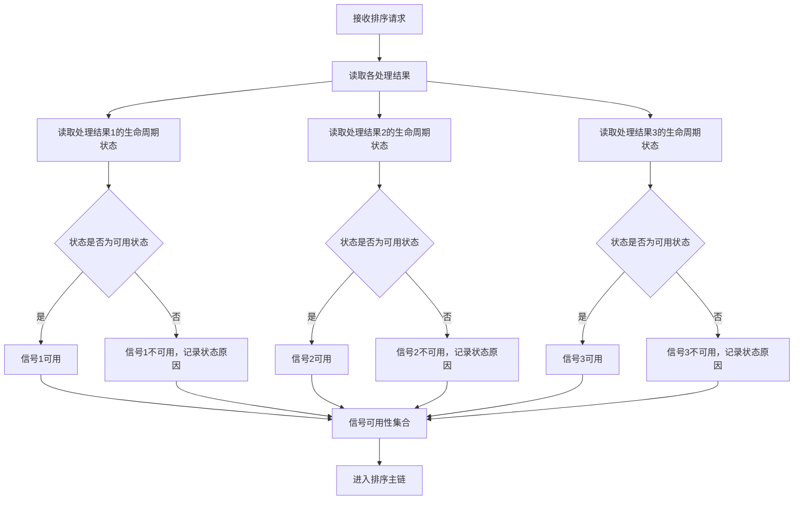
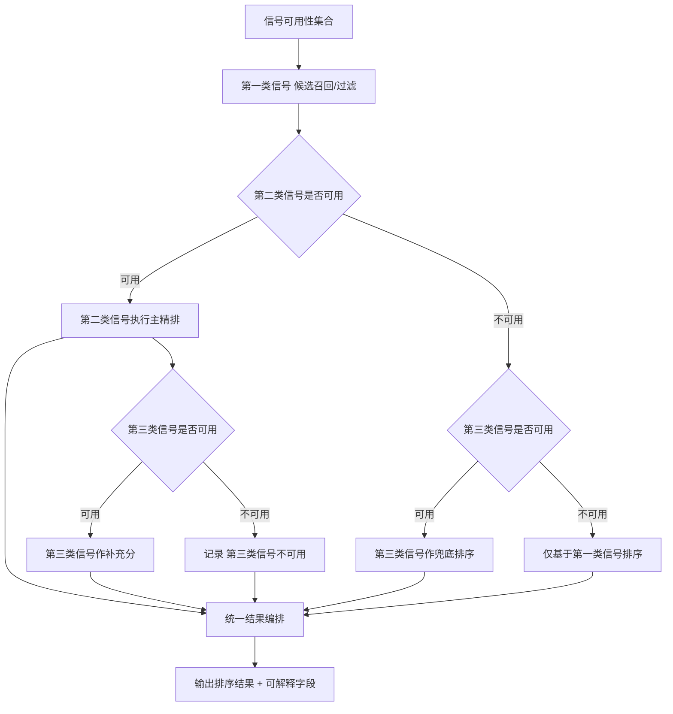
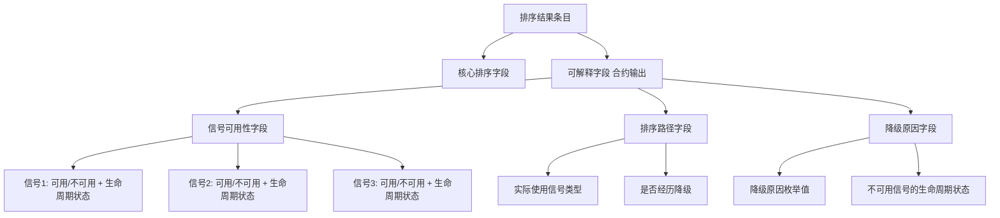
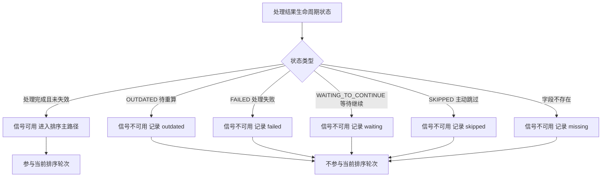

# 一种基于处理结果生命周期状态的端侧音频多信号排序与降级方法、系统、设备及存储介质

## 1. 发明名称

一种基于处理结果生命周期状态的端侧音频多信号排序与降级方法、系统、设备及存储介质。

## 2. 技术领域

本发明涉及音频信息处理、终端侧内容检索与推荐技术领域，尤其涉及一种在移动终端或其他端侧设备上，依据音频对象各类处理结果的当前生命周期状态判断排序信号可用性，并按照固定优先级主链执行多信号排序与降级的方法、系统、设备及存储介质。

## 3. 背景技术

在端侧本地音频搜索与推荐场景中，系统通常会对每个本地音频对象执行多类处理，并为每类处理生成相应结果，例如基础信息结果、音频识别结果、本地特征结果等。在执行搜索或推荐时，系统需要决定哪些信号可以参与排序，以及在部分信号缺失时如何执行降级。

现有方案通常采用以下方式判断排序信号是否可用：

第一类方式是字段存在性检查。即检查对应字段是否非空（非 null、非空集合、非空字符串），若字段存在则认为该信号可用，若字段不存在则认为该信号不可用。该方式简单，但无法区分"字段已存在但处于失效状态"与"字段已存在且当前可用"之间的差异。

第二类方式是置信度阈值检查。即对信号结果附加置信度分值，排序时只纳入高于阈值的信号。该方式关注信号质量，但通常不关注信号结果自身的生命周期状态，例如该结果是否已被标记为待重算、是否因处理失败而暂存、是否因设备条件不足而暂未完成。

第三类方式是统一降级策略。即在主要信号缺失时，统一降级到次级信号，但降级条件通常只依赖"当前轮次是否提取到该信号"，而非依赖"对应处理结果的当前生命周期状态"。

现有技术中，上述方式通常也不要求排序结果携带可解释输出，调用方无法区分某条结果是通过哪条信号路径排出、发生了哪种降级。

## 4. 现有技术缺陷

现有技术至少存在以下缺陷。

1. 字段存在性检查不足以表达信号可用性。处于失效（如结果已过期待重算）、失败（如处理出错）、等待继续（如设备条件不满足）或主动跳过状态的处理结果，其字段可能仍然存在，但对应信号已不再适合参与当前排序。直接用字段非空判断信号可用性，会导致不可靠信号参与排序，影响排序质量。

2. 缺少信号优先级主链约束。现有方案通常将多路信号以线性权重融合或随机组合，没有明确固定哪类信号在精排阶段优先，哪类信号作为补充或降级兜底。这使得排序逻辑在不同信号组合下的行为不可预期，难以验证和回归。

3. 降级路径不可枚举、不可核查。现有方案在多信号缺失时的降级处理往往是临时拼凑，既无法在设计阶段穷举所有降级场景，也无法在运行时记录实际走了哪条降级路径。

4. 排序结果缺乏可解释输出。调用方接收到排序结果后，通常无法得知该结果是基于哪类信号排出、是否经历了降级、信号可用性是否完整。这使得调用方难以区分高质量结果与降级结果，也难以对排序行为进行监控和诊断。

## 5. 发明要解决的技术问题

本发明要解决的技术问题是：在端侧音频搜索推荐场景下，系统已经为本地音频对象形成了多类处理结果，每类结果都存在相应的生命周期状态。在执行排序时，如何依据这些处理结果的当前生命周期状态判断哪些信号真正可用，从而避免失效、失败或未完成的处理结果误参与排序；如何在多信号可用性不同的情况下，按照固定优先级主链执行排序，并按照可枚举的降级规则处理信号缺失场景；以及如何在排序结果中强制输出可解释字段，使调用方能够区分信号可用情况和实际排序路径。

进一步地，本发明还要解决以下问题：

- 如何定义处理结果生命周期状态与信号可用性之间的映射规则；
- 如何在多信号场景下固定优先级主链，使排序行为在设计阶段即可预期；
- 如何在运行时记录实际执行的排序路径与降级原因，作为合约字段输出而非内部日志。

## 6. 技术方案

为解决上述问题，本发明提供一种基于处理结果生命周期状态的端侧音频多信号排序与降级方法，该方法运行于终端设备中，包括如下步骤：

### 6.1 总体方法

1. 接收搜索或推荐请求，确定目标音频对象或种子音频对象。

2. 读取系统中已存储的各类处理结果，并获取每类处理结果的当前生命周期状态。

3. 依据各处理结果的生命周期状态，判断对应排序信号是否可用，形成当前请求的信号可用性集合。

4. 按照预设的固定优先级排序主链，利用信号可用性集合执行多阶段排序；当某一信号不可用时，依据预定义的降级规则进入对应降级路径。

5. 在排序结果中强制输出可解释字段，至少包括各信号的可用性状态、实际使用的信号类型和实际执行的排序路径。

### 6.2 生命周期状态与信号可用性的映射

所述生命周期状态至少包括以下几类：

- 可用状态：对应处理结果已生成完成，且当前未失效、未失败、未跳过，该状态下对应信号可参与排序主路径。
- 失效状态（如 `OUTDATED`）：对应处理结果曾经生成，但已被标记为待重算，处于该状态的结果不应参与当前排序主路径。
- 失败状态（如 `FAILED`）：对应处理结果本轮生成失败，处于该状态的结果不应参与当前排序主路径。
- 等待继续状态（如 `WAITING_TO_CONTINUE`）：对应处理尚未完成，等待后续条件满足，处于该状态的结果不应参与当前排序主路径。
- 跳过状态（如 `SKIPPED`）：对应处理本轮被主动跳过，处于该状态的结果不应参与当前排序主路径。

所述映射规则的核心约束是：信号是否可用，由对应处理结果的当前生命周期状态决定，而非仅由对应字段是否存在决定。字段存在但处于失效、失败、等待继续或跳过状态的处理结果，对应信号视为不可用。

### 6.3 固定优先级排序主链

所述固定优先级排序主链将多类排序信号按照预设顺序分配角色，至少包括：

1. 第一类信号（候选召回与过滤信号）：负责从候选集合中初步筛选相关对象，缩小排序范围。该类信号处于排序主链的最前端。

2. 第二类信号（主精排信号）：负责对候选集合中的对象执行高置信相似性判断，作为主要排序依据。当该类信号可用时，其排序结论优先于其他信号。

3. 第三类信号（补充排序与兜底信号）：负责在主精排信号缺失时作为兜底排序依据，或在主精排信号可用时作为补充分进行平分打散。

所述固定优先级排序主链在系统设计阶段即确定，不在运行时根据信号可用性动态调整主链顺序。

在一个实施例中，端侧音频场景下的排序主链可采用：基础信息信号（候选召回/过滤）→ 音频识别信号（主精排）→ 本地特征信号（补充/兜底），但本发明不限于该特定信号类型或该特定主链顺序。

### 6.4 降级规则

所述降级规则为穷举式定义，覆盖各信号可用性组合下的处理方式，至少包括：

1. 第一类信号可用、第二类信号可用、第三类信号不可用：第二类信号执行主精排，记录第三类信号不可用原因。

2. 第一类信号可用、第二类信号不可用、第三类信号可用：第三类信号作为兜底排序信号，记录第二类信号不可用原因及兜底降级标记。

3. 第一类信号可用、第二类信号可用、第三类信号可用：第二类信号执行主精排，第三类信号作为补充分，记录补充标记。

4. 第一类信号可用、第二类与第三类信号均不可用：仅基于第一类信号排序，记录两类信号不可用原因。

5. 全部信号均不可用：返回空结果，记录无可用信号标记。

所述降级规则在系统设计阶段即穷举定义，每种信号组合对应唯一的处理路径，不存在未定义的降级场景。

### 6.5 可解释输出

所述可解释字段为排序结果的合约字段，而非内部诊断日志，至少包括：

1. 信号可用性字段：对每类信号，记录其对应处理结果的当前生命周期状态，以及据此判定该信号是否可用。

2. 排序路径字段：记录本次排序实际使用了哪类信号、执行了哪条降级路径。

3. 降级原因字段：当发生降级时，记录具体降级原因，至少包括：信号字段已存在但处于失效状态、信号字段已存在但处于失败状态、信号字段已存在但处于等待继续状态、信号字段已存在但处于跳过状态、信号字段不存在等。

所述可解释字段与排序结果一同返回给调用方，调用方可据此区分高质量排序结果与降级排序结果，并可用于后续监控、诊断和回归分析。

### 6.6 系统组成

与上述方法对应，本发明还提供一种系统，该系统至少包括：

- 生命周期状态读取模块，用于在排序阶段读取各处理结果的当前生命周期状态；
- 信号可用性判断模块，用于依据生命周期状态映射规则判断各信号是否可用；
- 排序主链执行模块，用于按照固定优先级主链执行多阶段排序；
- 降级规则执行模块，用于在信号不可用时按照预定义降级规则执行降级；
- 可解释输出模块，用于在排序结果中生成信号可用性、排序路径和降级原因等合约字段。

## 7. 有益效果

相较于现有技术，本发明至少具有以下有益效果。

1. 通过依据生命周期状态判断信号可用性，可避免失效、失败、等待继续或跳过状态的处理结果误参与排序，提升排序结果的准确性和稳定性。

2. 通过固定优先级排序主链，可使排序行为在多种信号组合下保持可预期，便于设计阶段验证和线上回归。

3. 通过穷举定义降级规则，可消除未定义降级场景，使每种信号组合都有确定的处理路径，降低排序逻辑的不确定性。

4. 通过将可解释字段作为排序结果的合约字段输出，可使调用方在不了解排序内部实现的情况下，仍能区分结果质量和排序路径，提升系统整体的可观测性。

5. 通过将生命周期状态判断与字段存在性检查分离，可为后续处理结果状态演进（如新增状态类型）提供稳定的排序可用性判断扩展点，而不需要修改排序逻辑本身。

## 8. 附图说明

为更清楚地说明本发明实施例或现有技术中的技术方案，可在后续正式申请文件中配套如下附图：

1. 图 1：信号可用性判断流程图。用于示出如何从各处理结果的生命周期状态映射到排序信号可用性。

2. 图 2：固定优先级排序主链与降级路径图。用于示出多信号可用性组合下的排序主链执行与降级分支。

3. 图 3：可解释字段输出结构图。用于示出排序结果中可解释字段的组成及其与信号可用性、排序路径的对应关系。

4. 图 4：生命周期状态与信号可用性映射关系图。用于示出不同生命周期状态类型对应的信号可用性判定结论。

## 9. 具体实施方式

以下结合一个非限制性的端侧本地音乐搜索推荐实施例，对本发明进行详细说明。本实施例中的具体信号类型、状态名称或接口命名仅为便于理解，不构成对本发明保护范围的限制。

### 9.1 读取处理结果与生命周期状态

终端设备在接收到搜索或推荐请求后，首先读取系统中已存储的各类处理结果及其当前生命周期状态。

处理结果的生命周期状态独立于其字段内容存在。即使某处理结果的字段内容（如特征向量、指纹摘要等）已持久化存储，该结果的生命周期状态仍可能处于失效、失败或等待继续等非可用状态。排序阶段必须读取生命周期状态，而不能仅依赖字段内容是否存在。

### 9.2 生命周期状态映射为信号可用性

在一个实施例中，系统维护以下映射规则：

- 处理完成且未被标记为失效的结果，对应信号可用；
- 已被标记为待重算（如 `OUTDATED`）的结果，即使字段内容仍在存储中，对应信号不可用，记录不可用原因为 `signal_outdated`；
- 本轮处理失败（如 `FAILED`）的结果，对应信号不可用，记录不可用原因为 `signal_failed`；
- 处理尚未完成、等待条件满足（如 `WAITING_TO_CONTINUE`）的结果，对应信号不可用，记录不可用原因为 `signal_waiting`；
- 本轮被主动跳过（如 `SKIPPED`）的结果，对应信号不可用，记录不可用原因为 `signal_skipped`；
- 字段内容本身不存在的结果，对应信号不可用，记录不可用原因为 `signal_missing`。

上述映射规则在排序阶段统一执行，形成本次请求的信号可用性集合。

### 9.3 固定优先级排序主链执行

在一个实施例中，端侧音频搜索推荐场景采用以下固定优先级排序主链：

1. 基础信息信号（候选召回与过滤）：若可用，则基于标题、歌手、专辑、时长等基础信息对候选集合进行初步过滤，缩小排序范围。

2. 音频识别信号（主精排）：若可用，则基于音频内容特征（如音频指纹的哈希比对）执行高置信相似性判断，将高置信相似对象排在前列。该类信号可用时，其排序结论优先于本地特征信号。

3. 本地特征信号（补充与兜底）：
   - 若音频识别信号不可用，则以本地特征信号（如本地向量相似度）作为兜底排序依据；
   - 若音频识别信号可用，则以本地特征信号作为补充分，用于平分打散。

上述主链顺序在系统设计阶段固定，不因运行时信号可用性变化而调整主链顺序。

### 9.4 降级规则执行

在一个实施例中，系统穷举如下降级场景：

- 基础信息信号可用、音频识别信号可用、本地特征信号不可用：音频识别信号执行主精排，输出可解释字段记录 `embedding_missing` 及不可用原因。
- 基础信息信号可用、音频识别信号不可用、本地特征信号可用：本地特征信号执行兜底排序，输出可解释字段记录 `fingerprint_missing` 与 `embedding_fallback`，以及音频识别信号的不可用原因。
- 基础信息信号可用、音频识别信号可用、本地特征信号可用：音频识别信号执行主精排，本地特征信号作为补充分，输出可解释字段记录 `embedding_tiebreak`。
- 基础信息信号可用、音频识别与本地特征信号均不可用：基于基础信息排序，输出可解释字段记录两类信号的不可用原因。
- 全部信号均不可用：返回空结果，输出可解释字段记录 `no_available_signal`。

每种场景的处理路径在系统设计阶段即确定，不存在未定义场景。

### 9.5 可解释字段输出

在一个实施例中，排序服务为每条排序结果及每次排序响应输出可解释字段，该字段作为服务合约的一部分，而非仅用于内部调试。

可解释字段至少包括：

- `signals`：对每类信号，记录其对应处理结果的生命周期状态及信号可用性判定结论；
- `reasons`：记录本次排序实际执行的路径，例如 `fingerprint_primary`（音频识别信号执行主精排）、`embedding_fallback`（本地特征信号兜底）、`embedding_tiebreak`（本地特征信号补充）、`no_available_signal`（无可用信号）等；
- 当发生降级时，记录不可用信号的具体不可用原因，例如 `signal_outdated`、`signal_failed`、`signal_waiting`、`signal_skipped`、`signal_missing`。

调用方可读取上述字段，区分高质量排序结果与降级排序结果，并可用于监控降级频率、诊断信号可用性问题。

### 9.6 一个贴近当前实现的例子

在一个贴近当前实现但非限制性的实施例中，系统对某本地音乐对象执行搜索时：

1. 读取该对象的音频识别处理结果，发现其生命周期状态为 `OUTDATED`（模型版本升级后待重算）；
2. 按照映射规则，音频识别信号判定为不可用，不可用原因为 `signal_outdated`；
3. 读取本地特征处理结果，发现其生命周期状态为处理完成且未失效；
4. 按照映射规则，本地特征信号判定为可用；
5. 依据降级规则，进入"音频识别信号不可用、本地特征信号可用"分支，执行兜底排序；
6. 输出排序结果，可解释字段记录 `fingerprint_missing`、`embedding_fallback`、`signal_outdated`。

若使用字段存在性检查，上述情景中音频识别信号字段仍然存在（历史结果未删除），会被误判为可用，进而参与排序，影响结果质量。本发明通过生命周期状态判断，可正确识别并排除该类情形。

## 10. 可选实施变形

在不偏离本发明核心思想的情况下，本发明还可以具有多种实施变形。

1. 所述生命周期状态类型不必限定为本文列举的几种，只要能够区分"当前可用于排序"与"当前不可用于排序"两类状态，即可按相同原理执行信号可用性判断。

2. 所述固定优先级排序主链不必限定为三类信号，也可以包含更多或更少的信号类型，核心约束是主链顺序在设计阶段固定，不在运行时动态调整。

3. 所述降级规则不必覆盖全部排列组合，可根据实际信号数量和业务需求定义必要的降级场景，但已定义场景应穷举对应处理路径。

4. 所述可解释字段的命名和结构可根据系统需要调整，但其作用应保持为让调用方能够区分信号可用情况、排序路径和降级原因，而非仅用于内部调试。

5. 所述方法不必限定于音乐场景，也可以扩展到播客、有声内容、短视频或其他可为端侧对象生成多类处理结果并维护生命周期状态的内容场景。

6. 信号可用性的判断可在每次排序请求时实时读取生命周期状态，也可以在处理结果状态变化时更新缓存的可用性标记，两种方式均适用本发明的核心原理。

## 11. 术语说明

为避免理解歧义，本交底书中的术语说明如下：

- `处理结果`：指系统对某音频对象执行某类处理（如基础信息提取、音频识别、本地特征提取等）后生成的结果对象。
- `生命周期状态`：指处理结果当前所处的状态，用于表达该结果是否处于可用、失效、失败、等待继续或已跳过等不同阶段。
- `信号可用性`：指在执行排序时，某类处理结果所对应的排序信号是否可以参与当前排序主路径。
- `固定优先级排序主链`：指在系统设计阶段预先确定的多信号排序优先级顺序，不在运行时根据信号可用性动态调整。
- `降级规则`：指在部分信号不可用时，系统按照预定义路径执行的替代排序策略，涵盖所有已知信号可用性组合。
- `可解释字段`：指作为排序结果合约的一部分输出给调用方的字段，用于说明信号可用性、排序路径和降级原因，区别于仅用于内部调试的日志。
- `字段存在性检查`：指仅依据结果字段是否非空来判断信号可用性的方式，本发明认为该方式不足以表达信号可用性。

## 12. 可直接供代理人提炼的核心创新点

为便于后续撰写权利要求，现将本发明中相对稳定的核心技术特征归纳如下：

1. 排序信号的可用性由对应处理结果的当前生命周期状态决定，而非仅由字段是否存在决定；
2. 失效、失败、等待继续、跳过状态下的处理结果，对应信号不参与排序主路径；
3. 多类排序信号按固定优先级排序主链执行，主链顺序在设计阶段确定；
4. 降级规则在设计阶段穷举定义，每种信号可用性组合对应唯一处理路径；
5. 可解释字段作为排序结果的合约字段输出，记录信号可用性、排序路径和降级原因；
6. 可解释字段中的降级原因区分字段不存在与字段存在但状态不可用两类情形。
