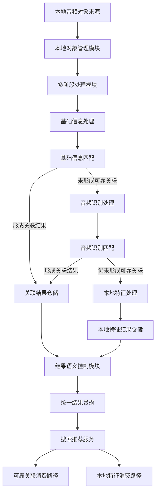
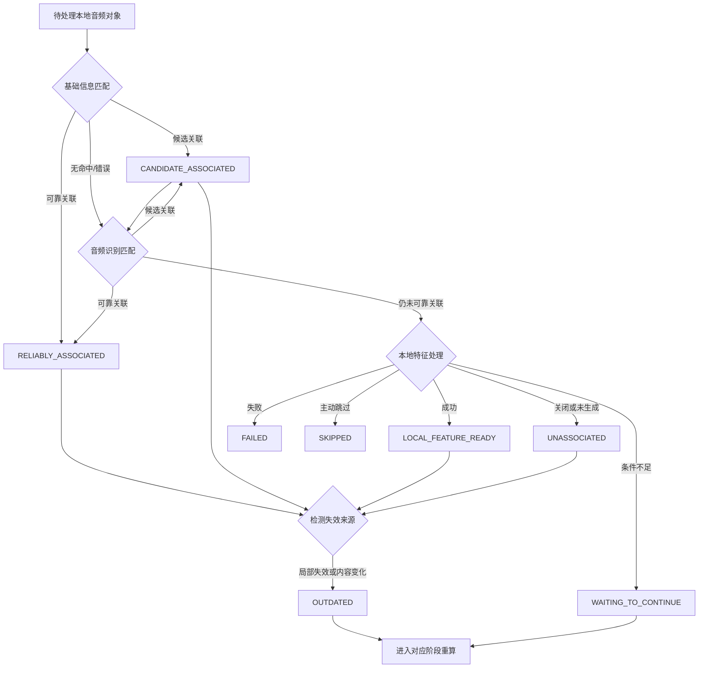
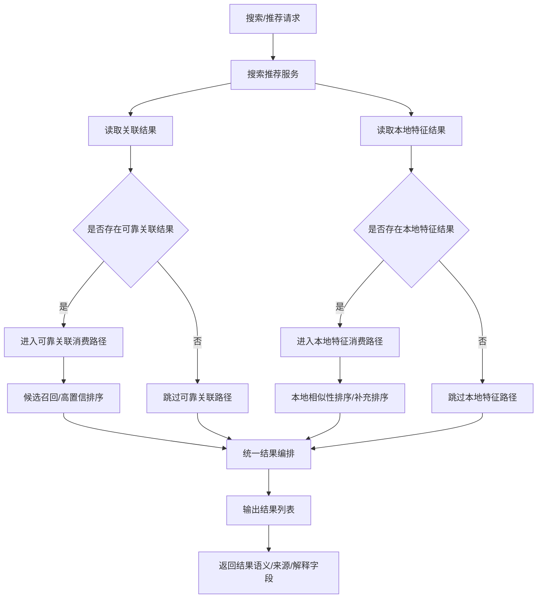
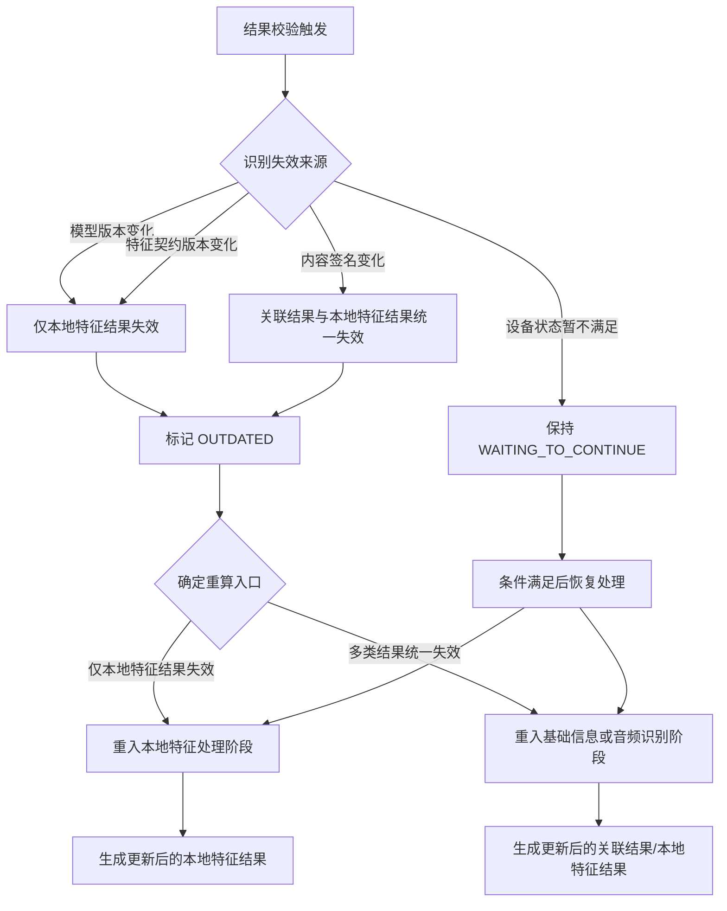

# 一种端侧音频特征结果与云端关联结果语义解耦的搜索推荐方法、系统、设备及存储介质

## 1. 发明名称

一种端侧音频特征结果与云端关联结果语义解耦的搜索推荐方法、系统、设备及存储介质。

## 2. 技术领域

本发明涉及音频信息处理、终端侧内容理解、检索与推荐技术领域，尤其涉及一种在移动终端或其他端侧设备上，对本地音频对象形成多类处理结果，并在不混淆结果语义的前提下执行搜索和推荐的方法、系统、设备及存储介质。

## 3. 背景技术

随着移动终端存储能力和本地媒体消费能力增强，越来越多的终端需要直接处理本地音乐文件，并向搜索、推荐、播放等上层业务输出可消费结果。现有方案大致可分为两类。

第一类方案主要面向歌曲识别或云端关联。该类方案通常根据标题、歌手、专辑、时长等基础信息，或者根据音频指纹等音频内容特征，对本地歌曲与云端歌曲库进行匹配，以获得可靠关联结果。该类方案的目标是“识别到是哪首歌”，一旦识别成功，即可继承云端歌曲的能力；一旦识别不足或失败，通常只能返回未识别、候选识别或错误状态。

第二类方案主要面向本地相似性计算或端侧推荐。该类方案通常在终端本地生成向量特征或其他本地相似性特征，并据此对本地歌曲进行相似度排序，以支持推荐、搜索或播放列表生成。该类方案的目标是“找出相似内容”，通常并不试图表达该本地结果是否已经与云端歌曲建立可靠关联。

现有技术中，上述两类方案一般各自独立。识别类方案强调高置信关联，但对识别不足后的后续消费支持较弱；本地推荐类方案强调本地可用性，但往往缺少与云端关联语义的明确边界。尤其在同一端侧系统中，若同时存在云端关联结果和本地特征结果，现有方案常见问题是直接按统一分值融合、直接以本地特征结果替代可靠关联结果，或者根本不允许识别不足的对象继续参与后续搜索推荐服务。

## 4. 现有技术缺陷

现有技术至少存在以下缺陷。

1. 识别方案与推荐方案割裂。现有识别方案通常在未形成可靠关联后即结束，无法让识别不足的歌曲继续以另一种结果语义参与搜索推荐。

2. 结果语义容易混淆。如果将本地向量特征结果直接视为识别成功结果，或者将本地相似性结果与可靠关联结果直接混合展示，会导致低置信结果污染高置信结果，破坏调用方对结果语义的稳定理解。

3. 消费路径缺乏边界。现有混合检索或混合排序方案往往只关心“能不能排出结果”，并不关心结果来自可靠关联还是本地特征可用，从而使调用方无法区分哪些结果可继承云端能力，哪些结果只能用于本地相似性消费。

4. 失效更新粒度粗糙。当本地模型版本、特征契约版本、音频内容签名等发生变化时，现有方案常采用全量失效、全量重算的方式，既增加资源消耗，也容易造成历史结果语义不清。

5. 终端侧统一服务能力不足。现有方案较少提供一种统一的端侧搜索推荐服务，使其能够同时读取多类结果，并按照各自语义路径并行消费、统一返回，而不在消费阶段反向触发新的高成本提取任务。

## 5. 发明要解决的技术问题

本发明要解决的技术问题是：在端侧本地音频处理场景下，当同一音频对象既可能形成云端关联类结果，又可能仅形成本地特征类结果时，如何在同一搜索推荐服务中同时利用两类结果，又避免本地特征结果错误地冒充可靠关联结果；如何在识别不足时仍保持搜索推荐可用；以及如何在结果版本变化或内容变化时按失效来源进行局部重算，而不是统一失效全部结果。

进一步地，本发明还要解决以下问题：

- 如何使端侧系统在形成多阶段处理结果后，对不同结果赋予不同语义权限；
- 如何使搜索推荐阶段能够按照结果语义执行差异化消费，而不将不同结果简单线性融合；
- 如何在终端资源受限场景下维持结果可用性和结果语义稳定性。

## 6. 技术方案

为解决上述问题，本发明提供一种端侧音频特征结果与云端关联结果语义解耦的搜索推荐方法，该方法运行于终端设备中，包括如下步骤：

### 6.1 总体方法

1. 获取待处理的本地音频对象，并建立该本地音频对象的本地记录。

2. 对所述本地音频对象执行多阶段处理，形成至少两类结果：
   - 关联结果，用于表征该本地音频对象是否已与云端歌曲建立可靠关联或候选关联；
   - 本地特征结果，用于表征该本地音频对象是否已具备本地相似性计算或本地可检索能力。

3. 对所述关联结果与本地特征结果进行结果语义解耦处理，使两类结果在状态含义、消费权限、失效规则和对外暴露语义上彼此独立。

4. 在搜索推荐阶段，基于所述关联结果和所述本地特征结果分别执行对应消费路径，并在同一搜索推荐服务中统一返回结果。

5. 当检测到内容变化、模型版本变化、特征契约版本变化或其他失效来源时，仅对受影响的结果类型执行局部失效与重算，而不对全部结果统一失效。

### 6.2 结果语义解耦

所述结果语义解耦至少包括以下约束：

1. 本地特征结果仅表征本地相似性计算能力可用、本地检索能力可用或本地推荐能力可用，不表征已经建立可靠云端关联。

2. 当本地特征结果生成成功时，不改写已有的关联结果语义；即，若此前未形成可靠云端关联，则本地特征结果不能将该音频对象提升为可靠关联对象。

3. 当关联结果表征可靠关联时，该结果可进入可继承云端能力的消费路径；当仅存在本地特征结果时，该结果仅进入本地相似性消费路径。

4. 本地特征结果的内部诊断信息与业务可消费语义分离，业务对外暴露仅保留本地特征可用所需的公共字段，不暴露不必要的内部推理细节。

### 6.3 并行消费

所述同一搜索推荐服务中的并行消费，指搜索推荐服务可同时读取关联结果和本地特征结果，但按照不同语义路径处理，至少包括：

1. 对可靠关联对象，优先根据其关联结果参与搜索、推荐或播放能力消费；

2. 对未形成可靠关联但具备本地特征结果的对象，根据本地特征结果参与本地相似性排序、补充排序或本地检索；

3. 在统一结果响应中保留结果来源、结果语义或可解释字段，使调用方可区分该结果来自可靠关联路径还是本地特征路径；此处所述可解释字段，用于区分结果来自关联类路径还是本地特征类路径，不涉及排序阶段对各信号处理结果生命周期状态的逐项记录；

4. 搜索推荐服务只消费已有结果，不在前台消费路径中反向触发新的音频解码、指纹生成或模型推理。

### 6.4 局部失效

所述局部失效至少包括：

1. 当检测到仅影响本地特征结果可用性的失效来源时，仅将本地特征结果标记为失效，并保持未受影响的关联结果继续可用；

2. 当检测到影响基础信息、音频指纹和本地特征结果的内容变化时，才对多类结果统一失效；

3. 在结果失效后，为对应结果保留可检测的过渡状态，使系统能够区分“结果仍可消费”“结果等待重算”“结果当前处理中”等不同生命周期状态；

4. 失效后的重算进入与失效来源对应的阶段，而不是固定回退到同一入口。

### 6.5 系统组成

与上述方法对应，本发明还提供一种系统，该系统至少包括：

- 本地对象管理模块，用于发现、记录和更新本地音频对象；
- 多阶段处理模块，用于对本地音频对象形成关联结果和本地特征结果；
- 结果仓储模块，用于分别持久化关联结果与本地特征结果；
- 结果语义控制模块，用于约束不同结果类型的对外语义及消费权限；
- 搜索推荐服务模块，用于按照结果语义并行消费多类结果并统一返回；
- 失效检测与重算模块，用于按失效来源执行局部失效和阶段性重算。

## 7. 有益效果

相较于现有技术，本发明至少具有以下有益效果。

1. 通过将关联结果与本地特征结果明确解耦，可避免低置信本地结果污染高置信云端关联结果，提升结果语义稳定性。

2. 通过允许识别不足对象以本地特征结果继续参与搜索推荐，可在未形成可靠关联时仍保持服务可用性，避免识别链路失败后完全无结果。

3. 通过在同一搜索推荐服务内并行消费多类结果，并保留结果解释边界，可兼顾统一服务接口与不同结果语义的消费差异。

4. 通过将内部诊断信息与业务结果字段隔离，可降低调用方误用内部推理细节的风险，并提高接口长期稳定性。

5. 通过按失效来源执行局部失效与局部重算，可减少不必要的全量重算，降低端侧资源消耗，并减轻结果语义混乱。

6. 通过将可靠关联路径和本地相似性路径分离，可为后续接入不同云端服务、不同本地模型或不同排序策略提供更稳定的扩展边界。

## 8. 附图说明

为更清楚地说明本发明实施例或现有技术中的技术方案，可在后续正式申请文件中配套如下附图：

1. 图 1：端侧音频对象处理与结果生成总体架构图。用于示出本地对象发现、多阶段处理、结果仓储、统一结果暴露及搜索推荐消费之间的关系。

2. 图 2：结果状态流转图。用于示出关联结果、本地特征结果以及等待继续、失效、失败等生命周期状态之间的流转关系。

3. 图 3：搜索推荐并行消费流程图。用于示出同一服务如何分别读取关联结果与本地特征结果，并按不同语义路径形成统一响应。

4. 图 4：局部失效与重算流程图。用于示出不同失效来源分别影响哪些结果类型，以及失效后如何回到对应阶段执行重算。

## 9. 具体实施方式

以下结合一个非限制性的端侧本地音乐处理实施例，对本发明进行详细说明。本实施例中的具体算法、模型或接口命名仅为便于理解，不构成对本发明保护范围的限制。

### 9.1 本地对象发现与记录

终端设备首先从本地媒体来源中发现本地音频对象。所述本地媒体来源可以是设备媒体库、文件系统扫描结果或其他可访问音频内容来源。系统为每个本地音频对象建立本地记录，并识别新增、删除、变化和不可访问情形。

若检测到本地音频对象未发生变化，则可不重复进入后续高成本处理阶段。该机制有助于减少不必要的资源消耗，但不是本发明的核心限定。

### 9.2 多阶段处理形成多类结果

在一个实施例中，所述多阶段处理采用分层链路：

1. 基础信息处理阶段：提取标题、歌手、专辑、时长等基础信息，并通过基础信息匹配形成可靠关联、候选关联、无命中或错误结果。

2. 音频识别处理阶段：当基础信息阶段未形成可靠关联时，对本地音频对象执行音频解码、音频指纹提取和音频识别匹配，以补充形成关联结果。

3. 本地特征处理阶段：当上述阶段仍未形成可靠关联，且设备条件允许时，对本地音频对象执行本地特征提取，形成本地特征结果。

在本实施例中，基础信息阶段和音频识别阶段主要用于形成关联结果；本地特征处理阶段主要用于形成本地特征结果。即使本地特征处理阶段成功生成本地特征结果，也不改变关联结果是否可靠的结论。

### 9.3 结果语义控制

在一个实施例中，系统将关联结果与本地特征结果分别持久化在不同结果仓储或不同逻辑区间中。系统同时维护结果类型和生命周期状态。

例如，可对外暴露以下业务结果状态：

- `RELIABLY_ASSOCIATED`：表示已可靠关联到云端歌曲；
- `CANDIDATE_ASSOCIATED`：表示仅形成候选关联；
- `LOCAL_FEATURE_READY`：表示未可靠关联，但本地特征已可用；
- `UNASSOCIATED`：表示当前没有可靠关联，且无本地特征结果。

还可对外暴露以下生命周期状态：

- `WAITING_TO_CONTINUE`：表示流程未结束，等待后续条件满足；
- `OUTDATED`：表示历史结果失效，等待重算；
- `FAILED`：表示本轮处理失败；
- `SKIPPED`：表示当前轮次主动跳过。

其中，`LOCAL_FEATURE_READY` 仅表示本地相似性或本地检索能力可用，不表示可靠云端关联。系统禁止将 `LOCAL_FEATURE_READY` 解释为 `RELIABLY_ASSOCIATED`。

上述生命周期状态的引入，旨在支持多类处理结果的有效性管理与局部失效判断，本发明不限定搜索推荐排序阶段利用上述状态判断各信号可用性的具体方式。

### 9.4 搜索推荐并行消费

在一个实施例中，终端提供统一的搜索推荐服务。所述服务在接收到搜索请求或推荐请求后，读取已经生成的结果，不再反向触发新的音频解码、音频指纹提取或模型推理。

该服务针对不同结果语义执行不同处理：

1. 当对象具有可靠关联结果时，允许其进入高置信消费路径，例如优先参与云端能力继承、结果展示或高置信排序。

2. 当对象未形成可靠关联，但具有本地特征结果时，允许其进入本地相似性消费路径，例如作为本地相似歌曲候选、作为缺失高置信信号时的补充排序对象或本地推荐对象。

3. 当两类结果同时存在于同一候选集合中时，服务不要求两类结果必须以同一语义直接融合，而是保留结果解释边界，并在统一响应中输出。

在一个具体实现中，搜索推荐服务还可为每条结果输出原因字段和信号字段，用于说明该结果属于关联路径、本地特征路径或降级路径，从而帮助调用方理解结果来源。

### 9.5 局部失效与重算

在一个实施例中，系统为不同结果维护不同失效来源。

例如：

- 当仅模型版本或特征契约版本变化时，仅使本地特征结果失效；
- 当音频内容签名变化时，使基础信息结果、音频识别结果和本地特征结果统一失效；
- 当设备状态暂不允许继续高成本阶段时，可先保持等待继续状态，而不是将现有结果统一清空。

进一步地，系统可在失效后将结果标记为 `OUTDATED`，并记录失效来源。随后，系统根据失效来源进入对应阶段重算。例如，仅本地特征结果失效时，仅重入本地特征处理阶段；而内容签名变化时，则可回到更早阶段重新处理。

### 9.6 一个贴近当前实现的例子

在一个贴近当前实现但非限制性的实施例中，端侧链路可采用：

`基础信息 -> 音频指纹 -> 本地 embedding`

三层顺序。

其中：

- 基础信息阶段负责低成本提取和低成本匹配；
- 音频指纹阶段负责更高置信的音频内容识别；
- 本地 embedding 阶段负责在无可靠关联时提供本地相似性计算能力。

搜索推荐阶段可采用如下原则：

- 先根据基础信息收窄候选；
- 当音频指纹可用时，优先利用其作为主精排或高置信相似性判断依据；
- 当音频指纹缺失但本地 embedding 可用时，将本地 embedding 用作补充排序或兜底排序；
- 即使本地 embedding 已可用，也不把该结果改写为可靠云端关联结果。

上述例子仅用于说明本发明能够如何落地到当前系统，不代表本发明仅限于上述特定排序主链、特定算法名称或特定模型名称。

## 10. 可选实施变形

在不偏离本发明核心思想的情况下，本发明还可以具有多种实施变形。

1. 所述关联结果不必限定为通过基础信息匹配和音频指纹匹配获得，也可以由其他识别方式、其他内容识别模型或外部关联服务获得。

2. 所述本地特征结果不必限定为 embedding，也可以是其他可用于本地相似性计算、候选过滤或排序补充的本地特征表达。

3. 所述统一搜索推荐服务不必限定为音乐场景，也可以扩展到播客、有声内容、短音频或其他可在端侧形成“关联结果 + 本地特征结果”的媒体对象场景。

4. 所述结果语义解耦不必限定为当前列举的状态名称，只要不同结果在语义、消费权限和失效规则上保持独立即可。

5. 所述局部失效也不必限定为模型版本、特征契约版本和内容签名，只要能够识别某一失效来源仅影响部分结果类型，即可按相同原理执行局部重算。

6. 所述统一响应中的解释字段、信号字段、诊断字段可根据系统需要调整命名或字段组织形式，但其作用应保持为帮助区分结果来源和消费路径，而非将不同结果语义抹平。

## 11. 术语说明

为避免理解歧义，本交底书中的术语说明如下：

- `关联结果`：指用于表达本地音频对象是否与云端歌曲建立可靠关联或候选关联的结果。
- `本地特征结果`：指用于表达本地音频对象是否具备本地相似性计算、本地检索或本地推荐能力的结果。
- `结果语义解耦`：指不同来源结果在状态含义、消费权限、失效规则和对外暴露语义上彼此独立，不互相冒充。
- `并行消费`：指搜索推荐服务可以同时读取多类结果，但按各自语义路径处理，并在统一服务中输出。
- `局部失效`：指根据失效来源，仅将受影响的结果类型标记失效并重算，而不统一失效全部结果。
- `可靠关联`：指足以使调用方将本地音频对象视为已关联到云端歌曲并继承相应能力的结果状态。
- `候选关联`：指形成了候选匹配，但尚不足以按可靠关联消费的结果状态。
- `等待继续`：指当前链路尚未结束，待条件满足后可继续处理的生命周期状态。

## 12. 可直接供代理人提炼的核心创新点

为便于后续撰写权利要求，现将本发明中相对稳定的核心技术特征归纳如下：

1. 对同一本地音频对象形成至少两类不同语义结果，即关联结果和本地特征结果；
2. 本地特征结果仅表征本地相似性或本地检索能力，不表征可靠云端关联；
3. 本地特征结果生成后不改写既有关联结果语义；
4. 搜索推荐阶段根据结果语义分别消费不同结果源，并在同一服务中统一返回；
5. 结果失效时按失效来源局部重算，而非统一失效全部结果；
6. 对外暴露的业务结果字段与内部诊断信息保持边界分离。
