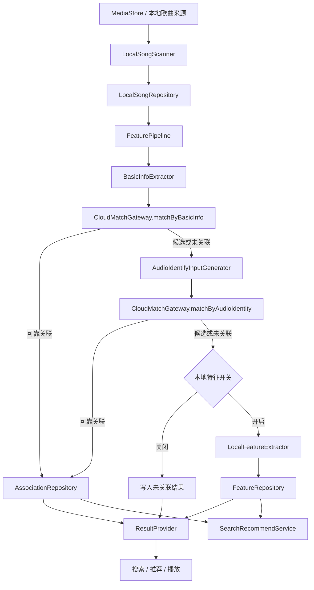

# Android 本地音乐特征能力总体设计 v0.1

这套能力要解决的不是“本地歌曲能不能扫出来”，而是本地歌曲能不能进入和云端歌曲相近的一套理解与消费体系。对客户端来说，事情可以拆成两半：前半段负责把本地歌曲处理清楚，尽量和云端歌曲建立可靠关系；后半段负责把已经得到的结果交给搜索、推荐和播放使用，而且语义要稳定。

当前版本已经把这条主线搭起来了：先扫本地歌曲，提取基础信息，低成本尝试关联；不够再进入音频指纹；还不够时，再用本地 embedding 做兜底。整个过程优先控制误绑定风险，不追求一开始就把覆盖率做满。

## 1. 范围

本期设计覆盖的内容包括：

- 本地歌曲扫描和变更识别
- 基础信息提取与 Mock 云端匹配
- 音频解码、指纹生成和 Mock 音频识别比对
- 本地 embedding 验证链路
- Search/Recommend 的端侧本地闭环
- 资源画像与性能测试自动化

不在本期范围内的内容也很明确：真实云端匹配、真实云端检索、线上推荐、在线学习以及真实用户侧的灰度和指标闭环，都还没进入这一版设计。

## 2. 设计取向

这套能力从一开始就不是“所有歌都跑最重的链路”。顺序上先低成本、后高成本：能用基础信息解决的，就不去做音频指纹；能在音频指纹阶段收口的，就不继续推模型。这样做不是保守，而是因为本地侧的时间、内存和 I/O 预算都比较紧，越往后面的链路越贵。

另一个取向是把“可靠关联”和“本地特征可用”分开看。`LOCAL_FEATURE_READY` 说明本地已有可消费的 embedding，但它不意味着已经和某首云端歌建立了可靠绑定。这个边界如果不守住，后面的搜索、推荐和展示语义都会被带偏。

最后，当前实现坚持 Mock 先行。真实服务端没接入之前，客户端主流程也要能独立闭环，所以核心逻辑只依赖统一抽象，不走 mock 专用分支。

## 3. 总体架构

这张图可以粗略理解成两层。上层是歌曲处理漏斗，从扫描开始一路往后推进；下层是结果消费，`ResultProvider` 和 `SearchRecommendService` 分别面向不同调用方暴露已经稳定下来的结果。搜索推荐不会反过来触发重型提取任务，它只消费已有信号。

## 4. 核心链路

### 4.1 扫描与入库

起点是 `MediaStore`。客户端先把用户可访问的本地歌曲整理成一份稳定集合，再识别其中哪些是新增、删除、不可访问或内容已变化。这个阶段的重点是把处理对象管住，而不是把后续高成本任务一股脑都跑起来。

### 4.2 基础信息关联

接下来读取标题、歌手、专辑、时长等基础信息，提交给 `CloudMatchGateway.matchByBasicInfo`。这是第一层低成本尝试。如果这里已经能形成可靠关联，后面的音频指纹和本地特征就没有必要继续执行。

### 4.3 音频识别兜底

基础信息不够时，再进入音频识别。这里不是直接对音频文件做 hash，而是先把音频解码为 PCM，再生成 `chromaprint-compatible` 指纹摘要，作为更高置信的识别输入。这一步比基础信息贵得多，但换来的是更接近“内容一致性”的判断能力。

### 4.4 本地 embedding 兜底

如果音频识别之后仍然没有可靠云端关联，才轮到本地 embedding。它的职责不是替客户端宣告“已经绑上云端”，而是在本地保留一份后续检索可用的相似性信号，让这首歌至少还能进入搜索推荐的兜底路径。

### 4.5 调用方消费

最终结果通过 `ResultProvider` 和 `SearchRecommendService` 往外走。播放、搜索、推荐看到的是稳定的业务状态、排序结果和 explain 信息，而不是底层每一步的执行细节。

## 5. 模块分工

`LocalSongScanner` 负责把本地歌曲集合稳定下来，识别新增、删除和变更；`BasicInfoExtractor` 负责把最便宜的一层识别信息提出来；`CloudMatchGateway` 把 mock 和未来真实服务的差异隔开。

`AudioIdentifyInputGenerator` 负责更重的一层内容处理，包括音频解码、片段策略和指纹生成；`LocalFeatureExtractor` 负责模型加载、推理和 embedding 产出，但只表达“本地特征是否可用”，不表达可靠云端绑定。

`FeaturePipeline` 负责把整条处理链串起来，决定什么时候继续、什么时候收口、什么时候等待重试；`ResultProvider` 再把内部状态翻译成外部能用的业务语义。搜索推荐部分单独由 `SearchRecommendService` 消费这些已有信号，并保持对外接口稳定。

## 6. 状态模型

当前对外最重要的几类状态如下：

| 状态 | 语义 |
| --- | --- |
| `RELIABLY_ASSOCIATED` | 已可靠关联到云端歌曲，可继承云端能力 |
| `CANDIDATE_ASSOCIATED` | 有候选关联，但默认不可按可靠关联消费 |
| `LOCAL_FEATURE_READY` | 无可靠云端关联，但已有本地 embedding 兜底 |
| `UNASSOCIATED` | 无可靠关联，且无本地特征兜底 |
| `WAITING_TO_CONTINUE` | 当前链路未结束，等待后续条件满足后继续 |
| `OUTDATED` | 结果已失效，等待重算 |
| `FAILED` | 本轮处理失败，可查看原因 |
| `SKIPPED` | 当前条件下主动跳过 |

这里最容易混淆的是三件事。第一，`LOCAL_FEATURE_READY` 不等于 `RELIABLY_ASSOCIATED`；第二，`CANDIDATE_ASSOCIATED` 默认不能进入强展示、强推荐或合并展示；第三，`OUTDATED` 不能简单理解成“所有信号都没用了”，它必须带着失效来源一起看。

## 7. 当前实现边界

这一版已经具备本地扫描、基础信息提取、Mock 基础信息匹配、音频解码与 `chromaprint-compatible` 指纹生成、Mock 音频比对、本地 embedding 验证，以及本地 Search/Recommend 检索排序闭环。`audio_identity` 和 `local_feature` 两条资源画像链路也已经拿到了真实样本。

还没进入这一版的，是几类真正线上化的能力：真实云端基础信息接口、真实音频指纹比对、真实云端检索、端云混排，以及模型正式下发和长期线上回归体系。

## 8. 设计约束

高成本任务必须受设备状态、前后台状态、热量和业务开关约束；否则这套能力即使功能上成立，也很难在真实设备里稳定运行。

本地 embedding 成功不能改写云端关联语义。搜索推荐在当前阶段只消费已有信号，不触发新的重型提取。云端未接入时，调用链路要能自然降级到本地路径，而不是把“还没接服务”包装成 `UNSUPPORTED`。

## 9. 关联文档

- 业务需求：[prd-v0.1.md](/Volumes/ORICO/git/ext/Blaster/.ai/prd/features/android-music-feature-extraction/prd-v0.1.md)
- 原始总体设计：[tech-design-v0.1.md](/Volumes/ORICO/git/ext/Blaster/.ai/prd/features/android-music-feature-extraction/tech-design-v0.1.md)
- 执行计划：[dev-plan-v0.1.md](/Volumes/ORICO/git/ext/Blaster/.ai/prd/features/android-music-feature-extraction/dev-plan-v0.1.md)
- 搜索推荐专题：[Android本地音乐特征能力-搜索推荐设计-v0.1.md](/Volumes/ORICO/git/ext/Blaster/.ai/prd/features/android-music-feature-extraction/Android本地音乐特征能力-搜索推荐设计-v0.1.md)
- 资源约束专题：[Android本地音乐特征能力-资源与运行约束说明-v0.1.md](/Volumes/ORICO/git/ext/Blaster/.ai/prd/features/android-music-feature-extraction/Android本地音乐特征能力-资源与运行约束说明-v0.1.md)
