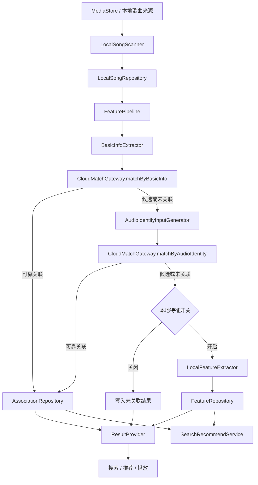

# Android 本地音乐特征能力总体设计 v0.1

当前版本覆盖本地歌曲扫描、基础信息匹配、音频指纹提取、本地 embedding 兜底、Search/Recommend 本地闭环，以及资源画像和性能测试自动化。真实云端匹配、真实云端检索、线上推荐、在线学习和灰度评估不在本期范围内。

目标有两件事。第一，把设备里的本地歌曲纳入统一处理链路，尽量和云端歌曲建立可靠关联。第二，在关联不足时保留本地可用结果，供搜索、推荐和播放消费。

## 1. 设计边界

当前版本包含：

- 本地歌曲扫描与变更识别
- 基础信息提取与 Mock 云端匹配
- 音频解码、指纹生成与 Mock 音频比对
- 本地 embedding 验证链路
- Search/Recommend 本地检索与排序闭环
- 资源画像与性能测试自动化

当前不包含：

- 真实云端基础信息匹配
- 真实云端音频指纹比对
- 真实云端检索与端云混排落地
- 线上推荐、在线学习和真实用户指标闭环
- 模型正式下发策略

## 2. 总体架构

处理部分和消费部分分开维护。前者负责扫描、提取、匹配以及结束条件；后者负责把已有结果对外暴露。搜索推荐只消费已有信号，不触发新的重型提取任务。

核心模块与仓储说明如下：

| 模块 | 角色 | 主要输入 | 主要输出 | 边界 |
| --- | --- | --- | --- | --- |
| `LocalSongScanner` | 扫描本地歌曲并识别变更 | `MediaStore`、文件可访问性、已有本地记录 | 新增、删除、变更、不可访问集合 | 只识别本地对象变化，不做歌曲关联判断 |
| `LocalSongRepository` | 持久化本地歌曲记录和扫描结果 | 扫描结果、歌曲基础元数据 | 本地歌曲记录、变更状态 | 只存本地对象与变更事实，不对外暴露业务语义 |
| `FeaturePipeline` | 编排整条处理顺序 | 待处理歌曲、设备状态、业务开关 | 下一阶段执行决定、等待或重试状态 | 负责流程推进，不直接产出对外业务结果 |
| `BasicInfoExtractor` | 提取低成本基础信息 | 待处理歌曲文件、本地记录 | 标题、歌手、专辑、时长等基础信息 | 只负责提取基础信息，不做高成本音频处理 |
| `CloudMatchGateway.matchByBasicInfo` | 执行基础信息匹配 | 基础信息请求 | 基础匹配结果 | 当前可接 Mock 实现，未来可替换真实服务实现 |
| `AudioIdentifyInputGenerator` | 生成音频指纹请求输入 | 本地音频文件、片段策略、基础上下文 | 指纹 payload、音频识别请求 | 只负责音频解码和请求组装，不负责匹配判断 |
| `CloudMatchGateway.matchByAudioIdentity` | 执行音频识别匹配 | 音频指纹请求 | 音频识别匹配结果 | 当前可接 Mock 实现，未来可替换真实服务实现 |
| `AssociationRepository` | 持久化关联结果 | 基础匹配结果、音频识别结果、关联来源 | 可靠关联、候选关联、关联来源记录 | 只存关联事实，不负责本地特征结果 |
| `LocalFeatureExtractor` | 生成本地 embedding | 本地音频数据、模型、运行条件 | embedding、模型信息、特征可用性 | 只表达本地特征是否可用，不表达可靠云端关联 |
| `FeatureRepository` | 持久化本地特征结果 | embedding、模型版本、schema 版本、状态 | 本地特征记录、版本信息、可用性状态 | 只存特征结果和版本信息，不替代关联仓储 |
| `ResultProvider` | 统一映射对外结果 | 关联结果、本地特征、生命周期状态 | 业务结果语义 | 负责统一对外暴露，不负责重型提取 |
| `SearchRecommendService` | 消费已有信号完成搜索推荐 | metadata、fingerprint、embedding、状态信息 | 搜索结果、推荐结果、诊断信息 | 只消费已有信号，不反向触发扫描、指纹或 embedding |

这里用到的几个术语含义如下：

| 术语 | 含义 |
| --- | --- |
| `Mock 云端匹配` | 本地可控的匹配实现，用于验证链路和契约，不代表真实线上接口已接入 |
| `本地 embedding` | 端侧模型输出的向量特征结果，用于本地相似性计算或补充排序 |
| `已有信号` | 已经落地并可读取的 metadata、fingerprint、embedding 等结果 |
| `高成本任务` | 音频解码、指纹生成、本地 embedding 推理这类资源开销较高的阶段 |
| `ResultProvider` | 统一读取内部结果并映射成调用方可消费语义的对外层 |
| `Search/Recommend 本地闭环` | 仅依赖本地已有信号完成检索、排序和返回结果的消费路径 |
| `资源画像` | 真实执行阶段的时延、CPU、内存、I/O 等观测结果集合 |

## 3. 处理顺序

处理顺序如下：

1. 扫描本地歌曲并识别新增、删除、不可访问和内容变化
   输入来自 `MediaStore` 和已有本地记录；输出为新增、删除、变更、不可访问集合。
2. 提取基础信息并执行低成本匹配
   输入为待处理歌曲；输出为基础信息和基础匹配结果。
3. 基础信息不足时进入音频指纹链路
   输入为未形成可靠关联的歌曲；输出为音频指纹请求和音频识别结果。
4. 音频识别仍不足时，根据开关和设备状态决定是否进入本地 embedding
   输入为仍无可靠关联且设备允许继续处理的歌曲；输出为本地 embedding 与可用性状态。
5. 通过 `ResultProvider` 和 `SearchRecommendService` 对外暴露结果
   输入为关联结果、本地特征和状态信息；输出为统一业务结果与 Search/Recommend 可消费信号。

顺序固定为先低成本、后高成本。基础信息已经足够时，不继续进入后面的重型阶段。

## 4. 模块分工

`LocalSongScanner` 负责本地歌曲扫描、变更识别和访问性判断。

`BasicInfoExtractor` 负责标题、歌手、专辑、时长等基础信息提取。

`CloudMatchGateway` 负责隔离 Mock 实现和未来真实服务实现。

`AudioIdentifyInputGenerator` 负责音频解码、片段策略和指纹生成。

`LocalFeatureExtractor` 负责模型加载、推理和 embedding 产出，只表达本地特征可用性，不表达可靠云端关联。

`FeaturePipeline` 负责决定是否继续下一阶段，以及如何等待和重试。

`ResultProvider` 负责把内部状态映射为调用方可用语义。

`SearchRecommendService` 负责消费 metadata、fingerprint、embedding 等已有信号，并保持对外接口稳定。

## 5. 状态模型

当前对外状态如下：

| 状态 | 类型 | 含义 | 是否对外暴露 | 是否表示当前流程结束 | 后续处理 |
| --- | --- | --- | --- | --- | --- |
| `RELIABLY_ASSOCIATED` | 业务结果状态 | 已可靠关联到云端歌曲，可继承云端能力 | 是 | 是 | 直接供调用方消费，不进入更高成本阶段 |
| `CANDIDATE_ASSOCIATED` | 业务结果状态 | 有候选关联，但默认不可按可靠关联消费 | 是 | 是 | 可保留候选结果，默认不进入强展示、强推荐和合并展示 |
| `LOCAL_FEATURE_READY` | 业务结果状态 | 无可靠云端关联，但已有本地 embedding 可用 | 是 | 是 | 可供本地消费，不等于云端可靠关联 |
| `UNASSOCIATED` | 业务结果状态 | 无可靠关联，且当前无本地特征结果 | 是 | 是 | 维持未关联结果，等待后续重新触发或补算 |
| `WAITING_TO_CONTINUE` | 生命周期状态 | 当前链路未结束，等待后续条件满足后继续 | 是 | 否 | 等待权限、设备状态或预算条件满足后继续 |
| `OUTDATED` | 生命周期状态 | 历史结果已失效，等待重算 | 是 | 否 | 根据失效来源重新进入对应阶段，不是最终失败 |
| `FAILED` | 生命周期状态 | 本轮处理失败，可查看原因 | 是 | 是 | 记录失败原因，等待重试或人工排查 |
| `SKIPPED` | 生命周期状态 | 当前条件下主动跳过 | 是 | 是 | 记录跳过原因，后续可重新进入 |

约束如下：

- `LOCAL_FEATURE_READY` 不等于 `RELIABLY_ASSOCIATED`
- `CANDIDATE_ASSOCIATED` 默认不进入强展示、强推荐和合并展示
- `OUTDATED` 必须带失效来源，不能默认解释为全部信号失效
- `WAITING_TO_CONTINUE` 表示流程未结束，不等于失败

## 6. 当前实现状态

当前版本已经具备：

- 本地扫描与基础信息提取
- Mock 基础信息匹配
- 音频解码与 `chromaprint-compatible` 指纹生成
- Mock 音频识别比对
- 本地 embedding 验证
- Search/Recommend 本地检索排序闭环
- `audio_identity` 与 `local_feature` 两条真实资源画像链路

当前仍未接入：

- 真实云端基础信息接口
- 真实音频指纹比对接口
- 真实云端检索和端云混排
- 模型正式下发与长期线上回归

## 7. 约束

高成本任务受设备状态、前后台状态、热量和业务开关约束。

本地 embedding 成功不改写云端关联语义。

云端未接入时，调用链路降级到本地路径，不返回 `UNSUPPORTED`。

搜索推荐只消费已有信号，不触发新的音频解码、指纹生成或模型推理。

## 8. 关联文档

- 业务需求：[prd-v0.1.md](/Volumes/ORICO/git/ext/Blaster/.ai/prd/features/android-music-feature-extraction/prd-v0.1.md)
- 原始总体设计：[tech-design-v0.1.md](/Volumes/ORICO/git/ext/Blaster/.ai/prd/features/android-music-feature-extraction/tech-design-v0.1.md)
- 执行计划：[dev-plan-v0.1.md](/Volumes/ORICO/git/ext/Blaster/.ai/prd/features/android-music-feature-extraction/dev-plan-v0.1.md)
- 搜索推荐专题：[Android本地音乐特征能力-搜索推荐设计-v0.1.md](/Volumes/ORICO/git/ext/Blaster/.ai/prd/features/android-music-feature-extraction/Android本地音乐特征能力-搜索推荐设计-v0.1.md)
- 资源约束专题：[Android本地音乐特征能力-资源与运行约束说明-v0.1.md](/Volumes/ORICO/git/ext/Blaster/.ai/prd/features/android-music-feature-extraction/Android本地音乐特征能力-资源与运行约束说明-v0.1.md)
