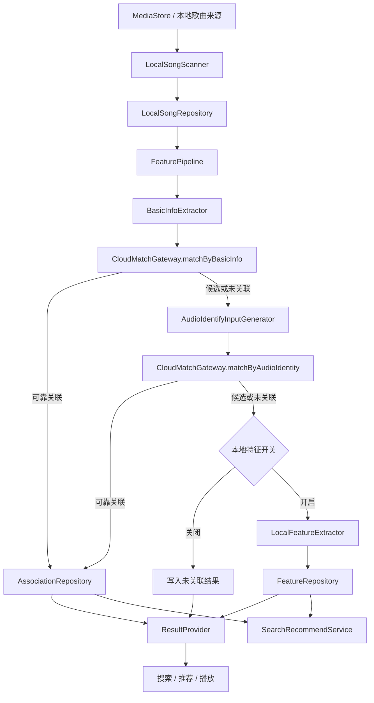

# Android 本地音乐特征能力总体设计 v0.1

当前版本覆盖本地歌曲扫描、基础信息匹配、音频指纹提取、本地 embedding 兜底、Search/Recommend 本地闭环，以及资源画像和性能测试自动化。真实云端匹配、真实云端检索、线上推荐、在线学习和灰度评估不在本期范围内。

目标有两件事。第一，把设备里的本地歌曲纳入统一处理链路，尽量和云端歌曲建立可靠关联。第二，在关联不足时保留本地可用结果，供搜索、推荐和播放消费。

## 1. 设计边界

当前版本包含：

- 本地歌曲扫描与变更识别
- 基础信息提取与 Mock 云端匹配
- 音频解码、指纹生成与 Mock 音频比对
- 本地 embedding 验证链路
- Search/Recommend 本地检索与排序闭环
- 资源画像与性能测试自动化

当前不包含：

- 真实云端基础信息匹配
- 真实云端音频指纹比对
- 真实云端检索与端云混排落地
- 线上推荐、在线学习和真实用户指标闭环
- 模型正式下发策略

## 2. 总体架构

处理部分和消费部分分开维护。前者负责扫描、提取、匹配以及结束条件；后者负责把已有结果对外暴露。搜索推荐只消费已有信号，不触发新的重型提取任务。

## 3. 处理顺序

处理顺序如下：

1. 扫描本地歌曲并识别新增、删除、不可访问和内容变化
2. 提取基础信息并执行低成本匹配
3. 基础信息不足时进入音频指纹链路
4. 音频识别仍不足时，根据开关和设备状态决定是否进入本地 embedding
5. 通过 `ResultProvider` 和 `SearchRecommendService` 对外暴露结果

顺序固定为先低成本、后高成本。基础信息已经足够时，不继续进入后面的重型阶段。

## 4. 模块分工

`LocalSongScanner` 负责本地歌曲扫描、变更识别和访问性判断。

`BasicInfoExtractor` 负责标题、歌手、专辑、时长等基础信息提取。

`CloudMatchGateway` 负责隔离 Mock 实现和未来真实服务实现。

`AudioIdentifyInputGenerator` 负责音频解码、片段策略和指纹生成。

`LocalFeatureExtractor` 负责模型加载、推理和 embedding 产出，只表达本地特征可用性，不表达可靠云端关联。

`FeaturePipeline` 负责决定是否继续下一阶段，以及如何等待和重试。

`ResultProvider` 负责把内部状态映射为调用方可用语义。

`SearchRecommendService` 负责消费 metadata、fingerprint、embedding 等已有信号，并保持对外接口稳定。

## 5. 状态模型

当前对外状态如下：

| 状态 | 语义 |
| --- | --- |
| `RELIABLY_ASSOCIATED` | 已可靠关联到云端歌曲，可继承云端能力 |
| `CANDIDATE_ASSOCIATED` | 有候选关联，但默认不可按可靠关联消费 |
| `LOCAL_FEATURE_READY` | 无可靠云端关联，但已有本地 embedding 兜底 |
| `UNASSOCIATED` | 无可靠关联，且无本地特征兜底 |
| `WAITING_TO_CONTINUE` | 当前链路未结束，等待后续条件满足后继续 |
| `OUTDATED` | 结果已失效，等待重算 |
| `FAILED` | 本轮处理失败，可查看原因 |
| `SKIPPED` | 当前条件下主动跳过 |

约束如下：

- `LOCAL_FEATURE_READY` 不等于 `RELIABLY_ASSOCIATED`
- `CANDIDATE_ASSOCIATED` 默认不进入强展示、强推荐和合并展示
- `OUTDATED` 必须带失效来源，不能默认解释为全部信号失效
- `WAITING_TO_CONTINUE` 表示流程未结束，不等于失败

## 6. 当前实现状态

当前版本已经具备：

- 本地扫描与基础信息提取
- Mock 基础信息匹配
- 音频解码与 `chromaprint-compatible` 指纹生成
- Mock 音频识别比对
- 本地 embedding 验证
- Search/Recommend 本地检索排序闭环
- `audio_identity` 与 `local_feature` 两条真实资源画像链路

当前仍未接入：

- 真实云端基础信息接口
- 真实音频指纹比对接口
- 真实云端检索和端云混排
- 模型正式下发与长期线上回归

## 7. 约束

高成本任务受设备状态、前后台状态、热量和业务开关约束。

本地 embedding 成功不改写云端关联语义。

云端未接入时，调用链路降级到本地路径，不返回 `UNSUPPORTED`。

搜索推荐只消费已有信号，不触发新的音频解码、指纹生成或模型推理。

## 8. 关联文档

- 业务需求：[prd-v0.1.md](/Volumes/ORICO/git/ext/Blaster/.ai/prd/features/android-music-feature-extraction/prd-v0.1.md)
- 原始总体设计：[tech-design-v0.1.md](/Volumes/ORICO/git/ext/Blaster/.ai/prd/features/android-music-feature-extraction/tech-design-v0.1.md)
- 执行计划：[dev-plan-v0.1.md](/Volumes/ORICO/git/ext/Blaster/.ai/prd/features/android-music-feature-extraction/dev-plan-v0.1.md)
- 搜索推荐专题：[Android本地音乐特征能力-搜索推荐设计-v0.1.md](/Volumes/ORICO/git/ext/Blaster/.ai/prd/features/android-music-feature-extraction/Android本地音乐特征能力-搜索推荐设计-v0.1.md)
- 资源约束专题：[Android本地音乐特征能力-资源与运行约束说明-v0.1.md](/Volumes/ORICO/git/ext/Blaster/.ai/prd/features/android-music-feature-extraction/Android本地音乐特征能力-资源与运行约束说明-v0.1.md)
