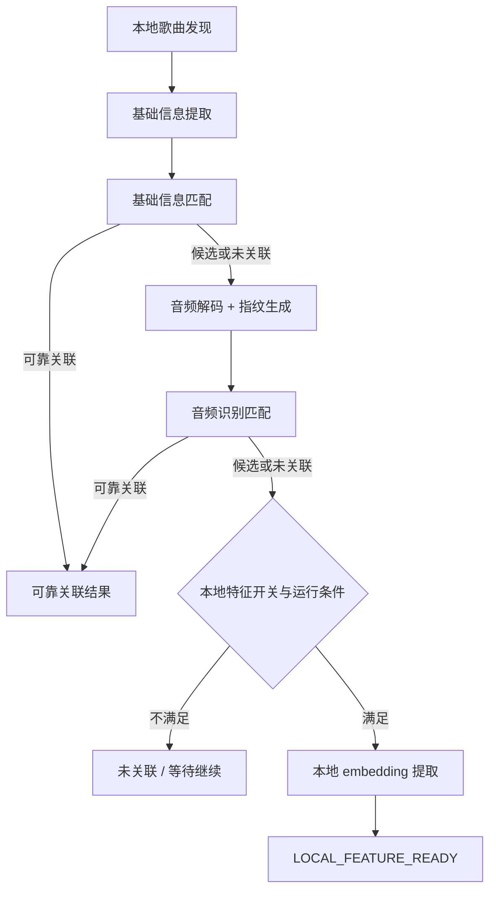

# Android 本地音乐特征能力歌曲理解与特征链路设计 v0.1

当前处理顺序分三层：基础信息、音频指纹、本地 embedding。前一层已经足够时，不进入后一层。后一层只补前一层的不足，不替前一层重做结论。

## 1. 链路总览

处理过程始终围绕两件事：结果是否已经足够可靠，设备是否允许继续执行更重的阶段。

## 2. 本地歌曲发现

进入条件：歌曲出现在 `MediaStore` 可访问范围内，或已有记录发生变化。

产出：本地歌曲集合、变更集、不可访问项、已删除项。

结束条件：文件删除、权限失效、未变化歌曲直接在本阶段结束，不重复进入后续高成本链路。

`LocalSongScanner` 负责新增、删除、访问性和内容变化判断。这个阶段不做歌曲识别，只管理待处理对象。

## 3. 基础信息提取与匹配

进入条件：歌曲已进入处理范围，且需要低成本匹配。

产出：标题、歌手、专辑、时长等基础信息，以及 `CloudMatchGateway.matchByBasicInfo` 的匹配结果。

结束条件：

- `RELIABLE`：链路结束
- `CANDIDATE`：保留候选结果，允许继续进入音频指纹
- `NONE`：进入音频指纹
- `ERROR`：按策略重试或进入 `WAITING_TO_CONTINUE`

结果分为：

- `RELIABLE`
- `CANDIDATE`
- `NONE`
- `ERROR`

定义如下：

- `RELIABLE` 表示基础信息已足够支撑可靠关联
- `CANDIDATE` 表示有候选结果，但不足以按可靠关联消费
- `NONE` 表示业务无命中，不计入技术失败重试
- `ERROR` 表示技术失败

## 4. 音频指纹链路

进入条件：基础信息未形成可靠关联。

产出：PCM 解码结果、`chromaprint-compatible` 指纹 payload、`AudioIdentityMatchRequest`、音频识别匹配结果。

结束条件：

- `RELIABLE`：链路结束
- `CANDIDATE` 或 `NONE`：根据开关与设备状态决定是否进入本地 embedding
- `ERROR`：按策略重试或等待继续

处理顺序如下：

1. 读取本地音频数据
2. 解码为 PCM
3. 按片段策略选择整首、较长片段或代表性片段
4. 生成 `chromaprint-compatible` 指纹摘要
5. 组装 `AudioIdentityMatchRequest`
6. 执行 `CloudMatchGateway.matchByAudioIdentity`

外层字段包括：

- `localSongId`
- `durationMs`
- `clipPolicy`
- `algorithm`
- `algorithmVersion`
- `payloadEncoding`
- `payload`
- `basicInfo`

字段说明如下：

| 字段 | 含义 | 来源 | 约束 |
| --- | --- | --- | --- |
| `localSongId` | 本地歌曲唯一标识，用于把本次音频识别请求和本地歌曲记录关联起来 | 本地歌曲记录 | 稳定外层字段；用于请求跟踪与结果回写 |
| `durationMs` | 本地歌曲时长，单位毫秒 | 本地歌曲元数据或扫描结果 | 稳定外层字段；用于片段策略和结果诊断，不应塞进 `payload` |
| `clipPolicy` | 指纹提取时采用的片段策略，例如整首、较长片段或代表性片段 | 提取策略配置与执行结果 | 稳定外层字段；表达“怎么取样”，不是算法内容本身 |
| `algorithm` | 当前使用的音频指纹算法标识 | 算法实现 | 稳定外层字段；当前首版固定为 `chromaprint-compatible` |
| `algorithmVersion` | 音频指纹算法版本 | 算法实现 | 稳定外层字段；用于兼容性判断和结果追踪 |
| `payloadEncoding` | `payload` 的编码方式 | 提取实现 | 稳定外层字段；用于说明 `payload` 如何被解析 |
| `payload` | 算法输出的音频指纹数据 | 音频指纹提取结果 | 只承载算法相关数据；不用于隐藏缺失外层字段 |
| `basicInfo` | 随音频识别请求一起传递的基础信息上下文，如标题、歌手、专辑、时长等 | 基础信息提取结果 | 作为辅助匹配上下文存在；不是音频指纹本体 |

补充说明：

- `PCM` 指未压缩的脉冲编码调制音频数据。当前设计先解码为 PCM，再做指纹提取，不直接对压缩文件做 hash。
- `chromaprint-compatible` 表示首版音频指纹输出遵循 Chromaprint 兼容语义，便于后续服务端按同类算法处理。
- `basicInfo` 在这里是辅助上下文，不改变音频指纹链路以音频内容为主的判断方式。

约束如下：

- `payload` 只承载算法相关指纹数据
- 不使用压缩文件 hash 或伪摘要代替音频指纹
- `forceScenario` 如存在，只用于 mock/demo 控制
- `timeout` 和 `degrade` 归入错误原因，不新增业务结果

如果指纹已经成功生成，但 compare 被关闭，本轮仍视为真实提取完成。

## 5. 本地 embedding 链路

进入条件：

- 前面没有拿到可靠云端关联
- 本地特征开关开启
- 当前设备状态允许执行高成本任务

产出：本地 embedding、模型信息、特征契约版本。

结束条件：

- 生成成功：`LOCAL_FEATURE_READY`
- 开关关闭或条件不满足：`UNASSOCIATED` 或 `WAITING_TO_CONTINUE`
- 技术失败：按策略记录失败原因

对外字段限制为：

- `embedding`
- `modelName`
- `modelVersion`
- `featureSchemaVersion`
- `generatedAtMs`

字段说明如下：

| 字段 | 含义 | 典型用途 | 对外边界 / 兼容性 |
| --- | --- | --- | --- |
| `embedding` | 本地模型输出的向量特征结果 | 供搜索、推荐等场景做本地相似性计算或 fallback 排序 | 对外结果字段；表示本地特征可用，不表示云端可靠关联 |
| `modelName` | 生成该特征的模型名称 | 区分不同模型实现，例如 YAMNet | 对外结果字段；用于追踪结果来源 |
| `modelVersion` | 模型版本标识 | 判断同一模型不同版本输出是否可比较 | 对外结果字段；模型版本变化可能触发旧结果失效 |
| `featureSchemaVersion` | 公共特征契约版本，表示外部如何理解这份 embedding | 约束序列化格式、维度、读取方式和兼容规则 | 对外结果字段；与 `modelVersion` 不同，schema 变化可直接触发 `OUTDATED` |
| `generatedAtMs` | 本地特征生成时间，单位毫秒时间戳 | 结果追踪、排查和版本比对 | 对外结果字段；用于判断结果新旧，不单独表示结果有效性 |

补充说明：

- `featureSchemaVersion` 关注的是“这份 embedding 对外怎么读、怎么存、怎么比”，不等于模型文件版本。
- `fallback` 在本页里表示“前面阶段不足时使用的补充结果”，不是“等价替代可靠关联”。

不对外暴露：

- 推理耗时
- top-K 分类
- 输入张量形状
- 内部失败细节

`LOCAL_FEATURE_READY` 只表示本地特征可用，不表示可靠云端关联。

`featureSchemaVersion` 表示公共特征契约版本，不等于单纯的模型文件版本。`modelVersion` 或 `featureSchemaVersion` 变化后，旧结果需要支持标记为 `OUTDATED`。

## 6. 状态推进

主路径如下：

1. `WAITING_TO_CONTINUE`
2. 基础信息或音频识别阶段直接得到 `RELIABLY_ASSOCIATED`
3. 若仍不足，继续进入本地 embedding
4. 最终变为 `LOCAL_FEATURE_READY`、`UNASSOCIATED`、`FAILED` 或 `SKIPPED`

`WAITING_TO_CONTINUE` 用于权限暂不可用、播放中、高温、低电量或预算不足等场景。

`OUTDATED` 需要绑定失效来源：

- 仅 embedding schema/version 变化：embedding 失效
- 内容签名变化：metadata、fingerprint、embedding 全部失效

状态语义如下：

| 状态 | 类型 | 含义 | 出现层级 | 是否表示流程结束 | 后续处理 |
| --- | --- | --- | --- | --- | --- |
| `RELIABLE` | 匹配结果 | 当前阶段已经得到足够可靠的匹配结果 | 基础信息匹配、音频识别匹配 | 是，对当前匹配阶段结束 | 不进入下一高成本阶段 |
| `CANDIDATE` | 匹配结果 | 有候选结果，但不足以按可靠关联消费 | 基础信息匹配、音频识别匹配 | 否 | 可保留候选信息，并继续下一阶段 |
| `NONE` | 匹配结果 | 业务无命中 | 基础信息匹配、音频识别匹配 | 否 | 可继续下一阶段；不计入技术失败重试 |
| `ERROR` | 匹配结果 | 当前阶段发生技术失败 | 基础信息匹配、音频识别匹配 | 否 | 记录原因，按策略重试或等待继续 |
| `LOCAL_FEATURE_READY` | 生命周期状态 | 本地特征已生成，可用于本地消费 | 本地 embedding 阶段结束后 | 是，对当前版本的特征生成阶段结束 | 可供调用方消费；不等于可靠云端关联 |
| `WAITING_TO_CONTINUE` | 生命周期状态 | 当前条件不满足，流程暂时停在这里 | 扫描、匹配、特征生成后的等待场景 | 否 | 等待权限、设备状态或预算条件满足后继续 |
| `UNASSOCIATED` | 生命周期状态 | 没有可靠关联，且当前没有本地特征结果 | 基础信息/音频识别/特征关闭后的最终结果 | 是 | 可保持现状，或等待后续重新触发 |
| `FAILED` | 生命周期状态 | 本轮处理失败，且未在当前轮次恢复 | 各阶段失败后 | 是，对本轮处理结束 | 保留原因，等待重试或人工排查 |
| `SKIPPED` | 生命周期状态 | 当前条件下主动跳过处理 | 各阶段可跳过场景 | 是，对本轮处理结束 | 记录跳过原因，后续可重新进入 |
| `OUTDATED` | 生命周期状态 | 历史结果失效，需要重算 | 持久化结果校验阶段 | 否，本质上是待更新状态 | 按失效来源重新进入对应处理阶段 |

补充说明：

- `RELIABLE / CANDIDATE / NONE / ERROR` 是当前匹配阶段的返回结果。
- `LOCAL_FEATURE_READY / WAITING_TO_CONTINUE / UNASSOCIATED / FAILED / SKIPPED / OUTDATED` 是写入持久化后的生命周期状态。
- `OUTDATED` 不直接说明哪一类信号失效，必须结合失效来源看是 metadata、fingerprint 还是 embedding 需要重算。

## 7. 数据存储与结果暴露

持久化对象包括：

- 本地歌曲记录
- 基础信息记录
- 云端关联结果
- 音频指纹摘要及诊断信息
- 本地特征结果
- 处理状态、错误原因和重试信息

调用方不直接消费底层诊断结构，统一通过 `ResultProvider` 读取业务结果。

调用方关注的结果只有几类：是否可靠关联、是否只有候选结果、是否具备本地特征 fallback、是否仍在处理中、是否已失效。

## 8. 运行约束

音频解码、指纹提取和本地 embedding 推理属于高成本阶段。

约束如下：

- 支持暂停、限流和延后执行
- 不明显影响播放和前台交互
- 不因未变化歌曲重复触发

## 9. 关联文档

- 原始总体设计：[tech-design-v0.1.md](/Volumes/ORICO/git/ext/Blaster/.ai/prd/features/android-music-feature-extraction/tech-design-v0.1.md)
- 总体执行计划：[dev-plan-v0.1.md](/Volumes/ORICO/git/ext/Blaster/.ai/prd/features/android-music-feature-extraction/dev-plan-v0.1.md)
- MVP 详细计划：`mvp-plans/` 目录
- 相关决策：
  - `decisions/2026-05-15-mvp3-audio-identity-contract-policy.md`
  - `decisions/2026-05-15-mvp3-chromaprint-android-native-policy.md`
  - `decisions/2026-05-15-mvp4-local-feature-contract-policy.md`
  - `decisions/2026-05-15-mvp4-yamnet-android-tflite-policy.md`
