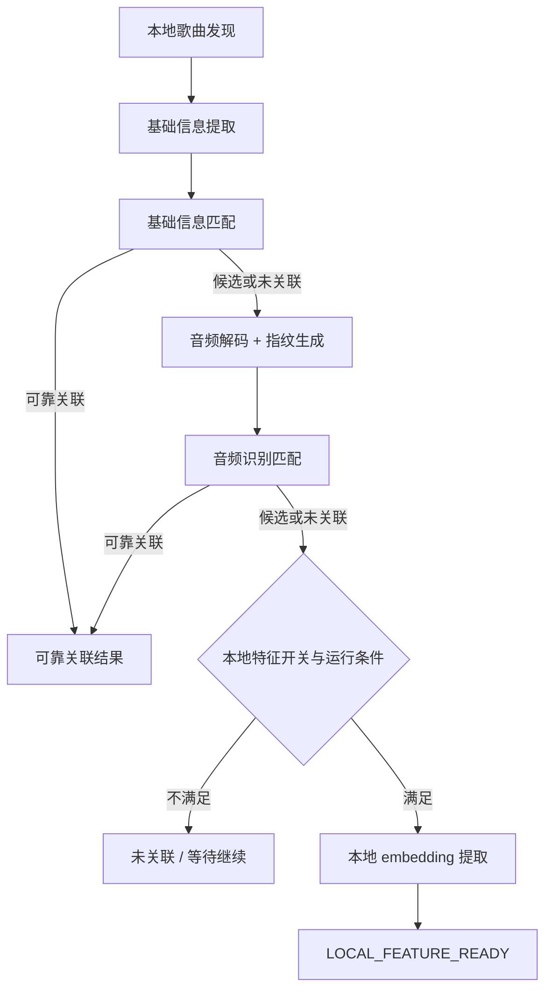

# Android 本地音乐特征能力歌曲理解与特征链路设计 v0.1

当前处理顺序分三层：基础信息、音频指纹、本地 embedding。前一层已经足够时，不进入后一层。后一层只补前一层的不足，不替前一层重做结论。

## 1. 链路总览

处理过程始终围绕两件事：结果是否已经足够可靠，设备是否允许继续执行更重的阶段。

## 2. 本地歌曲发现

进入条件：歌曲出现在 `MediaStore` 可访问范围内，或已有记录发生变化。

产出：本地歌曲集合、变更集、不可访问项、已删除项。

结束条件：文件删除、权限失效、未变化歌曲直接在本阶段结束，不重复进入后续高成本链路。

`LocalSongScanner` 负责新增、删除、访问性和内容变化判断。这个阶段不做歌曲识别，只管理待处理对象。

## 3. 基础信息提取与匹配

进入条件：歌曲已进入处理范围，且需要低成本匹配。

产出：标题、歌手、专辑、时长等基础信息，以及 `CloudMatchGateway.matchByBasicInfo` 的匹配结果。

结束条件：

- `RELIABLE`：链路结束
- `CANDIDATE`：保留候选结果，允许继续进入音频指纹
- `NONE`：进入音频指纹
- `ERROR`：按策略重试或进入 `WAITING_TO_CONTINUE`

结果分为：

- `RELIABLE`
- `CANDIDATE`
- `NONE`
- `ERROR`

定义如下：

- `RELIABLE` 表示基础信息已足够支撑可靠关联
- `CANDIDATE` 表示有候选结果，但不足以按可靠关联消费
- `NONE` 表示业务无命中，不计入技术失败重试
- `ERROR` 表示技术失败

## 4. 音频指纹链路

进入条件：基础信息未形成可靠关联。

产出：PCM 解码结果、`chromaprint-compatible` 指纹 payload、`AudioIdentityMatchRequest`、音频识别匹配结果。

结束条件：

- `RELIABLE`：链路结束
- `CANDIDATE` 或 `NONE`：根据开关与设备状态决定是否进入本地 embedding
- `ERROR`：按策略重试或等待继续

处理顺序如下：

1. 读取本地音频数据
2. 解码为 PCM
3. 按片段策略选择整首、较长片段或代表性片段
4. 生成 `chromaprint-compatible` 指纹摘要
5. 组装 `AudioIdentityMatchRequest`
6. 执行 `CloudMatchGateway.matchByAudioIdentity`

外层字段包括：

- `localSongId`
- `durationMs`
- `clipPolicy`
- `algorithm`
- `algorithmVersion`
- `payloadEncoding`
- `payload`
- `basicInfo`

约束如下：

- `payload` 只承载算法相关指纹数据
- 不使用压缩文件 hash 或伪摘要代替音频指纹
- `forceScenario` 如存在，只用于 mock/demo 控制
- `timeout` 和 `degrade` 归入错误原因，不新增业务结果

如果指纹已经成功生成，但 compare 被关闭，本轮仍视为真实提取完成。

## 5. 本地 embedding 链路

进入条件：

- 前面没有拿到可靠云端关联
- 本地特征开关开启
- 当前设备状态允许执行高成本任务

产出：本地 embedding、模型信息、特征契约版本。

结束条件：

- 生成成功：`LOCAL_FEATURE_READY`
- 开关关闭或条件不满足：`UNASSOCIATED` 或 `WAITING_TO_CONTINUE`
- 技术失败：按策略记录失败原因

对外字段限制为：

- `embedding`
- `modelName`
- `modelVersion`
- `featureSchemaVersion`
- `generatedAtMs`

不对外暴露：

- 推理耗时
- top-K 分类
- 输入张量形状
- 内部失败细节

`LOCAL_FEATURE_READY` 只表示本地特征可用，不表示可靠云端关联。

`featureSchemaVersion` 表示公共特征契约版本，不等于单纯的模型文件版本。`modelVersion` 或 `featureSchemaVersion` 变化后，旧结果需要支持标记为 `OUTDATED`。

## 6. 状态推进

主路径如下：

1. `WAITING_TO_CONTINUE`
2. 基础信息或音频识别阶段直接得到 `RELIABLY_ASSOCIATED`
3. 若仍不足，继续进入本地 embedding
4. 最终变为 `LOCAL_FEATURE_READY`、`UNASSOCIATED`、`FAILED` 或 `SKIPPED`

`WAITING_TO_CONTINUE` 用于权限暂不可用、播放中、高温、低电量或预算不足等场景。

`OUTDATED` 需要绑定失效来源：

- 仅 embedding schema/version 变化：embedding 失效
- 内容签名变化：metadata、fingerprint、embedding 全部失效

## 7. 数据存储与结果暴露

持久化对象包括：

- 本地歌曲记录
- 基础信息记录
- 云端关联结果
- 音频指纹摘要及诊断信息
- 本地特征结果
- 处理状态、错误原因和重试信息

调用方不直接消费底层诊断结构，统一通过 `ResultProvider` 读取业务结果。

调用方关注的结果只有几类：是否可靠关联、是否只有候选结果、是否具备本地特征 fallback、是否仍在处理中、是否已失效。

## 8. 运行约束

音频解码、指纹提取和本地 embedding 推理属于高成本阶段。

约束如下：

- 支持暂停、限流和延后执行
- 不明显影响播放和前台交互
- 不因未变化歌曲重复触发

## 9. 关联文档

- 原始总体设计：[tech-design-v0.1.md](/Volumes/ORICO/git/ext/Blaster/.ai/prd/features/android-music-feature-extraction/tech-design-v0.1.md)
- 总体执行计划：[dev-plan-v0.1.md](/Volumes/ORICO/git/ext/Blaster/.ai/prd/features/android-music-feature-extraction/dev-plan-v0.1.md)
- MVP 详细计划：`mvp-plans/` 目录
- 相关决策：
  - `decisions/2026-05-15-mvp3-audio-identity-contract-policy.md`
  - `decisions/2026-05-15-mvp3-chromaprint-android-native-policy.md`
  - `decisions/2026-05-15-mvp4-local-feature-contract-policy.md`
  - `decisions/2026-05-15-mvp4-yamnet-android-tflite-policy.md`
