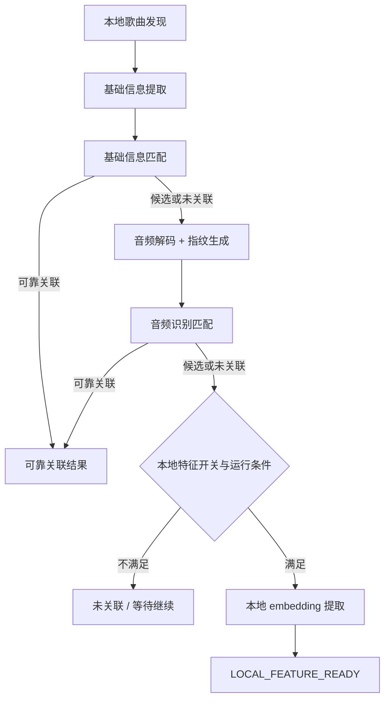

# Android 本地音乐特征能力歌曲理解与特征链路设计 v0.1

这篇文档只看一件事：一首本地歌曲进入系统之后，客户端如何一步步理解它、尝试把它和云端歌曲建立关系，以及在关系始终不够可靠时，怎样给后面的搜索推荐留下一条可用的兜底路径。

整条链路并不追求一步到位。它是典型的漏斗式处理：先走便宜的基础信息，再走更贵的音频指纹，最后才考虑本地 embedding。这样设计既是为了控制资源成本，也是为了把误绑定风险压在前面。

## 1. 链路总览

从图上看，客户端一直在做同一类判断：当前这首歌是否已经有足够可靠的结果，可以在这里收口；如果还不够，是否值得继续往下一层走。这个判断会同时受信号质量和设备运行条件影响。

## 2. 本地歌曲发现与基础信息

### 2.1 扫描

歌曲处理的起点是 `LocalSongScanner`。它首先从 `MediaStore` 拿到用户可访问的本地歌曲，再区分新增、删除、不可访问和内容变化几种情况。这里更像是在管理待处理对象，而不是在做识别本身。

如果一首歌没有变化，就不应该重新把所有高成本链路再跑一遍；如果文件已经删除或权限失效，也应该尽早在这里收口，而不是把问题带到后面。

### 2.2 基础信息提取

`BasicInfoExtractor` 负责把标题、歌手、专辑、时长这些低成本信息整理出来。主路径依然是系统元数据，文件名等兜底策略只在必要时使用。

这一层的目标很务实：尽可能用最便宜的方式把大部分歌曲挡在前面。基础信息不完整不代表后面完全没法做，但它不应该直接导向强绑定。

## 3. 基础信息匹配

基础信息匹配是整条漏斗的第一层关联尝试，由 `CloudMatchGateway.matchByBasicInfo` 承接。当前实际运行主要依赖 Mock 实现，不过从客户端视角看，这里已经是一层稳定抽象，后面接入真实服务时不应该改动主流程。

结果语义仍然维持在四类：

- `RELIABLE`
- `CANDIDATE`
- `NONE`
- `ERROR`

这四类结果在这里的含义很直接。`RELIABLE` 说明已经可以结束后续高成本链路；`CANDIDATE` 说明有参考价值，但还不够支撑可靠消费；`NONE` 是业务上没有命中，不应该计入技术失败重试；`ERROR` 才表示技术层面出了问题，需要决定是重试还是等待条件改善。

## 4. 音频指纹链路

### 4.1 什么时候进入这一层

只有基础信息没法给出可靠关联时，歌曲才会进入音频识别链路。之所以把这一层放在第二步，是因为它显著更贵，但也更接近歌曲内容本身。

### 4.2 处理过程

这里的核心不是“对音频文件做一个 hash”，而是把本地音频真正解码成 PCM，再按片段策略生成 `chromaprint-compatible` 指纹 payload，最后交给 `CloudMatchGateway.matchByAudioIdentity` 做比对。

处理顺序可以概括成 6 步：

1. 读取本地音频数据
2. 用系统能力解码为 PCM
3. 根据歌曲长度选择整首、较长片段或代表性片段
4. 生成 `chromaprint-compatible` 指纹摘要
5. 组装稳定的 `AudioIdentityMatchRequest`
6. 执行音频识别匹配

### 4.3 外层契约

当前稳定下来的外层字段包括：

- `localSongId`
- `durationMs`
- `clipPolicy`
- `algorithm`
- `algorithmVersion`
- `payloadEncoding`
- `payload`
- `basicInfo`

这里最重要的边界有两个。第一，`payload` 只承载算法相关的指纹数据，不拿来偷塞缺失的公共字段；第二，不能用压缩文件 hash 或任何伪造摘要来冒充音频指纹。否则表面上流程跑通了，实际结论没有意义。

`forceScenario` 这类字段如果在 demo 或 mock 中存在，也只能当控制开关看，不能把它带入长期公共契约。

### 4.4 结果如何收口

音频识别阶段仍然沿用 `RELIABLE / CANDIDATE / NONE / ERROR` 这套结果语义。这里不再新增 `TIMEOUT` 或 `DEGRADED` 这样的业务结果；超时和降级都归入错误原因，由诊断信息解释。

还有一个容易被误读的点：如果指纹已经成功生成，只是 compare 被关闭，这一轮仍然可以视为真实提取完成。它说明端侧这一步是真跑了，只是后面的比对没有打开。

## 5. 本地 embedding 链路

### 5.1 为什么放在最后

本地 embedding 不是默认主路径，而是留给“仍然没有可靠关联，但又希望后续检索还能利用这首歌”的场景。它比基础信息贵，也通常比简单的指纹比对更容易带来持续的 CPU、内存和 I/O 压力，所以应该放在最后。

### 5.2 进入条件

只有同时满足以下条件时，歌曲才继续往这层走：

- 前面还没有拿到可靠云端关联
- 本地特征开关开启
- 当前设备状态允许执行高成本任务

### 5.3 对外只暴露什么

这一层对外保留的是“本地特征可用”，不是“绑定成功”。公共结果字段应限制在：

- `embedding`
- `modelName`
- `modelVersion`
- `featureSchemaVersion`
- `generatedAtMs`

推理耗时、top-K 分类、输入张量形状和内部失败细节这些信息仍然有价值，但更适合作为诊断数据留在内部，不直接混进业务结果。

### 5.4 模型和版本

当前验证主线是 YAMNet TFLite，VGGish 还停留在备选位置。这里的版本边界要看两层：一层是模型版本，一层是公共特征契约版本，也就是 `featureSchemaVersion`。后者表达的是“外部怎么理解和使用这份 embedding”，不只是模型文件本身换没换。

一旦 `modelVersion` 或 `featureSchemaVersion` 发生变化，旧结果就必须有机会被显式标记为 `OUTDATED`，而不是静默覆盖掉。

## 6. 状态如何推进

大部分歌曲会沿着这样的主线前进：先进入 `WAITING_TO_CONTINUE`，然后在基础信息或音频识别阶段拿到 `RELIABLY_ASSOCIATED`，或者继续向后推进；如果直到本地特征阶段都没建立可靠关联，则最终落到 `LOCAL_FEATURE_READY` 或 `UNASSOCIATED`。

并不是所有中途收口都意味着失败。权限暂不可用、当前正在播放、设备高温低电量，或者业务主动关闭高成本能力，都可能把状态带到 `WAITING_TO_CONTINUE` 或 `SKIPPED`。这类收口表达的是“现在不适合继续”，不是“这首歌已经处理完了但失败”。

`OUTDATED` 的判断也需要看来源。仅仅是 embedding schema 或版本升级时，失效的只是 embedding；如果是内容签名变了，那 metadata、fingerprint 和 embedding 都应该重新计算。

## 7. 数据存储与结果暴露

链路里至少会沉淀几类对象：本地歌曲记录、基础信息、关联结果、音频指纹摘要、本地特征结果，以及处理状态和错误原因。它们服务的是不同阶段，不应该被调用方直接等价使用。

外部消费统一走 `ResultProvider`。调用方真正关心的通常只有几件事：这首歌是不是已经可靠关联、是不是只有候选结果、有没有本地特征可兜底、是不是还在处理中，或者当前结果是不是已经失效。底层诊断结构虽然重要，但最好留给排障和内部观测。

## 8. 运行约束

当前链路里最敏感的阶段仍然是音频解码与指纹提取，以及本地 embedding 推理。基础信息读取相对便宜，适合作为第一层过滤；后面的高成本链路则必须支持暂停、限流和延后执行，避免把后台处理压力直接带到播放和前台交互里。

## 9. 关联文档

- 原始总体设计：[tech-design-v0.1.md](/Volumes/ORICO/git/ext/Blaster/.ai/prd/features/android-music-feature-extraction/tech-design-v0.1.md)
- 总体执行计划：[dev-plan-v0.1.md](/Volumes/ORICO/git/ext/Blaster/.ai/prd/features/android-music-feature-extraction/dev-plan-v0.1.md)
- MVP 详细计划：`mvp-plans/` 目录
- 相关决策：
  - `decisions/2026-05-15-mvp3-audio-identity-contract-policy.md`
  - `decisions/2026-05-15-mvp3-chromaprint-android-native-policy.md`
  - `decisions/2026-05-15-mvp4-local-feature-contract-policy.md`
  - `decisions/2026-05-15-mvp4-yamnet-android-tflite-policy.md`
