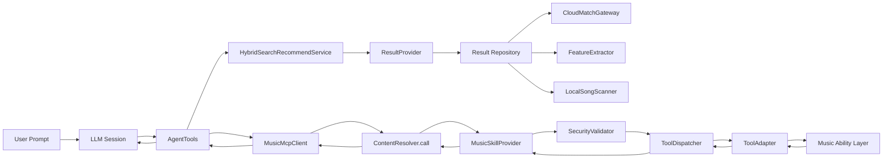
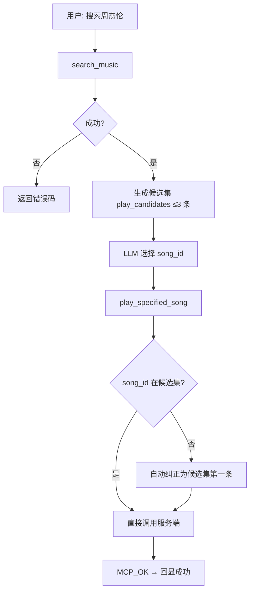
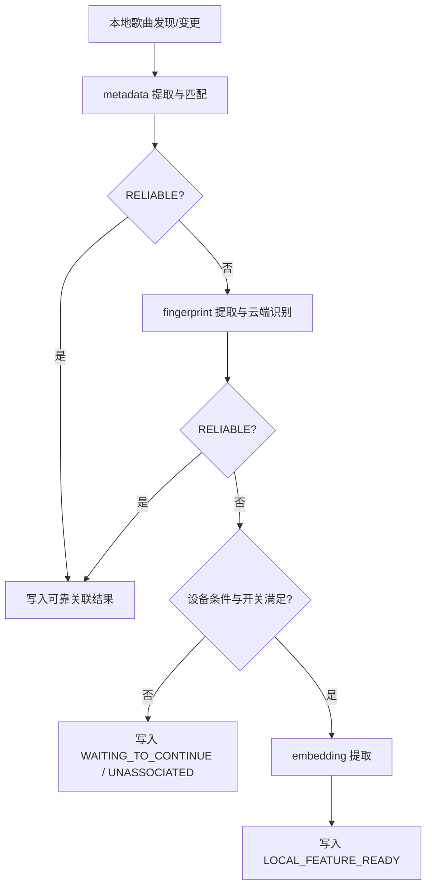
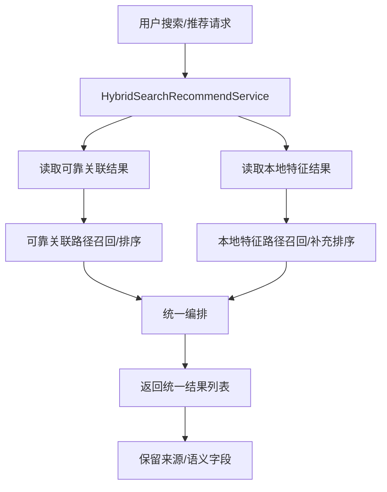
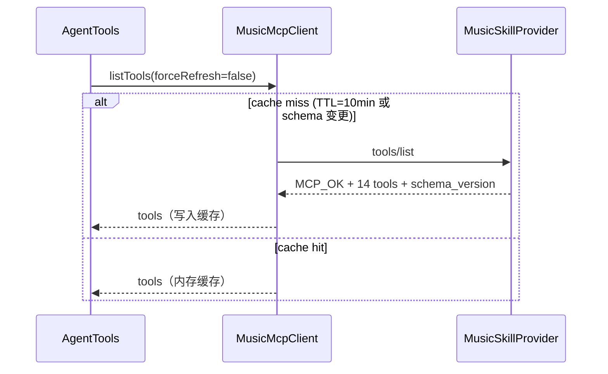

# 音乐端侧智能总览

本文记录当前 LLM 接入、Music Skill/MCP、端侧音乐特征提取和端云混合搜索推荐的方案边界与关键链路。

## 一、LLM 技术选型

端侧 LLM 目前有三条路：AICore（Google 系统级框架）、Gemma via LiteRT（Google 开源直集成）、国内厂商自有框架。三者对应的集成边界和约束不同。

**AICore** 是 Android 13+ 的系统级 AI 框架，OEM/Google 预装，模型由系统 OTA 管理。应用通过 `InferenceSession` 调用，不需要自己管理模型文件，多 App 共享同一模型实例。代价是模型版本受系统控制，Function Calling 规格还未完全明确。

**Gemma via Google AI Edge / LiteRT** 是应用自己集成运行时、自己从 HuggingFace 拉模型的方案。Gemma 4 家族（E2B / E4B）支持 Thinking Mode，FunctionGemma 270m finetune 的 Function Calling 已经在 Gallery Mobile Actions 和 Tiny Garden 跑通。当前限制是模型文件会占用用户存储（量化后 1-3 GB），中文能力也不是强项。Gallery 当前用的就是这套。

**国内厂商框架**（OPPO 小布 / 华为小艺 / 小米大模型）对本厂 NPU 做了深度优化，中文语料训练也更完整，延迟通常比 LiteRT GPU 路径要好。代价是完全绑定单一品牌，接口非标准化，跨品牌不可用，合作路径也依赖厂商节奏。

### 三方案对比

| 维度 | AICore (Google) | Gemma (LiteRT) | 国内厂商框架 |
|------|----------------|----------------|-------------|
| 集成方式 | 系统 API，模型系统管理 | 应用集成 LiteRT SDK | 厂商私有 SDK / AIDL |
| API 标准化 | Android 标准 API | Google AI Edge SDK | 非标准，各厂商私有 |
| 模型版本管理 | 系统 OTA 推送，应用无感知 | 应用控制，HuggingFace 下载 | 厂商 OTA 推送 |
| 隐私 / 离线 | 100% 端侧，无网络 | 100% 端侧，无网络 | 100% 端侧，无网络 |
| 最低 Android 版本 | Android 13+ | Android 12+ | 各厂商自定义 |
| 最低 RAM | 约 6 GB 可用内存 | E2B ≥ 4 GB / E4B ≥ 8 GB RAM | 厂商规格（通常 6–12 GB） |
| 存储占用 | 系统共享，不占 App 存储 | 量化后 1–3 GB，占用户存储 | 系统预装，不占 App 存储 |
| NPU / GPU 加速 | OEM 实现（可利用 OPPO NPU） | LiteRT GPU delegate / NNAPI | 厂商专属 NPU（性能最优） |
| 中文能力 | 中等 | 中等（英文优先训练） | 优（专项中文语料） |
| Function Calling | 框架支持（规格待确认） | FunctionGemma 270m，已实装 | 各厂商规格不一 |
| 可移植性 | 高（Android 标准） | 高（跨品牌） | 低（厂商锁定） |
| 开发可控性 | 中（依赖系统 API 迭代） | 高（SDK 版本自主） | 低（厂商接口变更风险） |
| 适用场景 | 系统级深度集成、Google 生态 | 快速原型、跨品牌、模型自定义 | 深度 OEM 合作、中文场景优先 |

### 性能与硬件要求

延迟方面，Gemma E2B 开 GPU delegate 的 TTFT 约 500ms–1s，TPS 大概 20–40；E4B 慢一倍，而且必须开 GPU 加速，CPU 模式基本不可用。AICore 因为系统常驻理论上冷启动更快，但受调度影响抖动会大一些。国内厂商框架 NPU 路径通常是最快的，但没有公开 benchmark 可以直接拿来对比。

内存压力随上下文增长，E2B 的 KV Cache 大概 512 MB–1 GB，E4B 1–2 GB。E4B 在 6 GB RAM 的设备上基本跑不稳，实际上默认应该是 E2B，E4B 仅在明确确认 ≥ 8 GB RAM 时启用。还有一个容易忽视的问题：LLM 推理是 GPU 密集的，而音频解码在 DSP/CPU 上跑，两者同时跑时要留意内存水位，可以用异步串行推理规避最坏情况。

Gallery 现在用 LiteRT 加载 Gemma，agent-core 封装了 MCP 调用链路，LLM 实现层对 MCP 层是透明的，后续换模型不影响下游。

## 二、Music Agent：三条路径与必要性

当前链路是 `LLM/小布/MobileClaw → ApiProxy → MusicSkillProvider`。小布直接调 skill，没有中间的 Music Agent 层。14 个 skill 是原子能力，每次调一个。音乐 app 在这个链路里是 **skill provider**，不拥有 LLM，也不做 agent 编排。

### 三条路径

| 维度 | 厂商 agent（小布/OAssist） | Android ADK | 自研 Music Agent |
|------|--------------------------|------------|----------------|
| LLM 来源 | OPPO 系统内置，NPU 加速，中文优化 | Google AICore | 端侧（Gemma）或自建云端 LLM |
| 与 MusicSkillProvider 集成 | 直接调 skill，天然支持 | skill provider 角色，需适配 | 完整栈，自己拥有 skill 调用层 |
| 多步编排能力 | 通用 LLM 自行编排 | 通用框架自行编排 | 可定制音乐域编排逻辑 |
| 跨品牌 | ❌ OPPO 专属 | ✅ 跨 OEM | ✅ 跨品牌 |
| 开发独立性 | 依赖 OPPO 节奏，外网无法接入 MobileClaw | 依赖 Google ADK 版本 | 完全自主 |
| LLM 基础设施负担 | 无（OPPO 负责） | 无（AICore 负责） | 高（端侧集成或云端自建） |
| 当前成熟度 | 生产级，已有内网验证路径 | 成熟期，Function Calling 待确认 | POC 阶段（Gallery 验证） |
| 典型场景 | OPPO 设备的主路径 | 未来跨 OEM 标准 | App 内嵌 AI / 跨品牌覆盖 |

### 自研 Music Agent 是否必要

结论先放前面：当前不需要自研 Music Agent，也不需要 agent call agent。

音乐控制的编排逻辑目前很轻，基本是 `search → play` 两步或 `query → control` 一步。通用 LLM（小布）可以直接编排这 14 个 skill。现网链路里也没有 sub-agent 通路。

如果要做 App 内嵌 AI 对话，音乐 app 就要自己承担 LLM 基础设施。

- 端侧 LLM（Gemma via LiteRT）：集成 SDK、管理 1-3 GB 模型文件、处理 OOM 和设备兼容
- 云端 LLM：自建推理服务，或接入第三方，网络依赖、API 成本、数据合规都要处理

对 OPPO 设备来说，小布已经提供了 LLM 基础设施，音乐 app 只需要把 skill 做好。再让音乐 app 团队维护一套 LLM 栈，投入不合算。

当前可以分成两种定位：

- **Skill Provider（当前路径）**：专注把 14 个 tool 做稳、做准，对外暴露标准接口。LLM、agent 编排都是外部的，小布/ADK/任何 agent 调用都可以。成本低，聚焦，跟音乐 app 的核心能力匹配。
- **AI Product（重投入路径）**：音乐 app 自己拥有 LLM + agent + skill 完整栈，做 App 内嵌的 AI 音乐体验。产品差异化强，但工程量级完全不同，且还没有明确的产品需求驱动。

现阶段 Gallery + agent-core 更接近技术验证，不等于已经决定走 AI Product 路径。在没有明确产品形态之前，自研 Music Agent 不进入生产主路径。

### 应用场景（若走 AI Product 路径）

| 场景 | 描述 | 关键 Tool |
|------|------|----------|
| 自然语言播放控制 | "播放周杰伦最新专辑"、"暂停"、"下一首" | `play_specified_song` / `control_playback` |
| 搜索 → 播放 多步骤任务 | 搜索候选 → 模型选择 → 播放 → 可选收藏 | `search_music` → `play_specified_song` → `favorite_song` |
| 上下文感知 | 结合对话历史、当前播放状态调整推荐 | `query_current_song` / `query_playback_state` |
| 语音入口 | Audio Scribe 语音转文字 → 指令解析 → MCP 执行 | 全链路 |
| 听歌识曲路由 | 识别当前环境音乐 → 跳转相关页面 | `identify_music` → `open_music_page` |
| 进度控制 | "快进 30 秒"、"跳到第 2 分钟" | `seek_playback` |

### Music 侧性能要求

端到端延迟目标是 < 2s，这里面包括 LLM 推理时间和 MCP 调用的往返。ContentProvider.call 超时后服务端返回 `MCP_INTERNAL_ERROR`（retriable=true），客户端最多重试一次，退避 200–500ms。重试时复用同一 `request_id` 和 `nonce`，防止播放器收到两次播放指令。

## 三、Music Skill 设计

统一走 `ContentProvider.call`，14 个 tool 覆盖音乐的完整控制面，页面跳转走 Deeplink / StartActivity。

### P0 能力清单

| Tool 名称 | 能力描述 | 通道 |
|----------|---------|------|
| `play_specified_song` | 播放指定 song_id 歌曲 | CP call |
| `play_music_by_type` | 按类型播放（local/favorite/recent/daily）| CP call |
| `search_music` | 按关键词搜索音乐 | CP call |
| `control_playback` | 控制播放（play/pause/next/prev/stop）| CP call |
| `favorite_song` | 收藏/取消收藏/查询状态 | CP call |
| `identify_music` | 听歌识曲 | CP call + Deeplink |
| `get_play_list` | 获取当前播放列表 | CP call |
| `open_music_page` | 打开指定页面 | CP call + Deeplink |
| `control_volume` | 音量控制（up/down/set/mute）| CP call |
| `get_song_info` | 获取歌曲信息（当前或指定 song_id）| CP call |
| `get_music_resource` | 获取音乐资源（收藏/最近/每日推荐）| CP call |
| `query_playback_state` | 查询播放状态与进度 | CP call |
| `seek_playback` | 跳转播放进度（毫秒）| CP call |
| `query_current_song` | 查询当前播放歌曲 | CP call |

### ContentProvider 接口约定

```text
URI:     content://com.allsaints.music.assistant.skill
权限:    com.oplus.permission.safe.ASSISTANT
入口:    ContentProvider.call(method, arg, extras)
方法解析: extras.skill_method > arg > method
```

**通用返回字段**：

- `apiproxy_biz_code`（`"0"` = 成功）
- `apiproxy_biz_message`
- `apiproxy_biz_text`
- `apiproxy_biz_tts`
- `apiproxy_biz_raw_data`（业务数据 JSON）

**卡片字段规则**（按 tool）：

| Tool | 卡片类型 | 额外字段 |
|------|---------|---------|
| `search_music` / `identify_music` / `open_music_page` | 跳转卡片 | `ui_card_type`, `jump_data` |
| `favorite_song` | 开关卡片 | `switch_status`, `switch_open_api`, `switch_close_api` |
| `get_play_list` / `get_music_resource` | 列表卡片 | `param_list_api`, `list_item_json` |
| `query_playback_state` / `control_volume` | 进度条卡片 | `process_bar_api`, `process_bar_value` |

### 实现策略

调用优先走 `ThirdpartPlayUtil.stub.execute/executeAsync`，返回"不支持/未实现/关键数据缺失"时再走 `PlayManager` 兜底。这样做是为了优先复用现有业务能力，不引入新接口，同时避免双通路行为不一致。页面跳转统一走 Deeplink。

### 三层封装设计

音乐能力到 LLM 可调用工具，经过三层封装：

**第一层（业务能力层）**是现有的音乐能力，没有任何 AI 专属接口：`ThirdpartPlayUtil`、`PlayManager`、`AudioManager`、页面跳转的 Deeplink。这一层只管把音乐功能做对，不关心谁来调用。

**第二层（Skill 封装）**以 ContentProvider 为边界，把业务能力包成标准 skill 接口：method 就是 skill 名，响应格式统一为 `apiproxy_biz_code / message / text / tts / raw_data` 加各类 UI 卡片字段。这一层是给小布/OAssist 直接调用的（legacy 路径）。业务能力层对 skill 协议完全透明。

**第三层（MCP 协议）**叠加在同一个 ContentProvider 入口之上：当 method 是 `tools/call` 时，走 MCP 路径，实际 `tool_name` 和参数包在 `extras.request_json` JSON 里；当 method 是具体 skill 名时，走 legacy 路径。MCP 路径把 `apiproxy_biz_*` 映射进统一的 MCP envelope，并附加了 `auth_context` 校验、审计日志和 session 管理。业务能力层对 MCP 协议同样透明。

```text
小布 → ContentProvider.call(method="play_specified_song", extras=业务参数)
                         ↓ legacy 路径，直接分发
                    MusicSkillProvider
                         ↓
                    音乐业务能力层

Gallery → ContentProvider.call(method="tools/call", extras={"request_json": MCP JSON})
                         ↓ MCP 路径，解析 JSON，安全校验，参数归一化
                    MusicSkillProvider
                         ↓
                    音乐业务能力层（返回 apiproxy_biz_* → 映射为 MCP envelope）
```

### 接入大模型的方案

#### 为什么 Android 上走 ContentProvider 而不是 HTTP

标准 MCP（Anthropic 规范）的传输层是 HTTP/SSE/stdio，适合服务端或桌面 agent。Android 的进程间通信走 IPC（Binder/ContentProvider/AIDL），不走 TCP/HTTP。在 Android 上跑 HTTP server 需要持久进程、端口、网络权限，后台生命周期也受系统限制。ContentProvider 是原生 IPC，权限由 PackageManager 强制管理，不需要端口，进程生命周期和安全边界都更合适。

Music MCP 因此用 ContentProvider 作传输层。MCP 的 JSON 请求/响应结构不变，只是把 HTTP 换成了 `ContentProvider.call()`。

#### 两条调用路径

Android 上的 agent 有两条路径可以调音乐能力：

**MCP 路径（推荐）**：`ContentProvider.call(method="tools/call", extras={"request_json": MCP JSON})`。附加了 `auth_context`、统一 error code、审计日志、session 管理。agent 侧需要实现 `McpClient`（组包 JSON、解析 envelope、处理 session 和重试），agent-core 提供了参考实现。

**Legacy Skill 路径**：`ContentProvider.call(method="play_specified_song", extras={params})`。直接调具体 skill，无 session 和统一鉴权，小布通过 OAssist 框架代理调用。更简单，但安全和观测能力相对薄弱。

新 LLM 框架接入 Music MCP 时，两条路径都能用。差别在于是否需要 MCP 的安全和可观测能力。

#### 非 Android 环境扩展

如需在非 Android 环境（云端 agent、桌面 MCP 客户端）接入，需要一个 HTTP → ContentProvider 桥接层，把 ContentProvider 调用包成标准 REST API，MCP 的 JSON 格式不需要改变。agent-core 已通过 `McpTransport` 接口预留了这个扩展点，当前只实现了 `ContentProviderMcpTransport`，未来可以新增 `HttpMcpTransport` 而不改动上层逻辑。

## 四、MCP 协议设计

### 协议冻结信息

**响应 envelope（固定）**：

```json
{
  "success": true,
  "code": "MCP_OK",
  "message": "string",
  "retriable": false,
  "trace_id": "string",
  "data": {}
}
```

**错误码语义**：

| code | 含义 | retriable |
|------|------|----------|
| `MCP_OK` | 执行成功 | false |
| `MCP_INVALID_ARGUMENT` | 参数 / 协议字段非法 | false |
| `MCP_UNAUTHORIZED` | 鉴权失败 | false |
| `MCP_BUSINESS_ERROR` | 业务执行失败 | false |
| `MCP_INTERNAL_ERROR` | 内部异常 / 超时 | **true** |
| `MCP_ROUTE_BLOCKED` | 客户端路由策略拦截 | false |

**错误映射规则**：

- `apiproxy_biz_code = "0"` → `MCP_OK`
- `apiproxy_biz_code = "1001"` → `MCP_INVALID_ARGUMENT`
- 其他非 0 → `MCP_BUSINESS_ERROR`
- 超时 / 异常 → `MCP_INTERNAL_ERROR`（retriable=true）

### 固定路由

- `session/open`：建立 / 续期会话
- `tools/list`：获取工具列表（含 `schema_version`）
- `tools/call`：执行具体工具

### 请求结构

```json
{
  "request_id": "req_xxx",
  "trace_id": "trace_xxx",
  "method": "tools/call",
  "tool_name": "search_music",
  "params": { "keyword": "周杰伦" },
  "auth_context": {
    "client_id": "gallery-agent",
    "package_name": "com.google.aiedge.gallery",
    "token": "xxx",
    "nonce": "nonce_xxx",
    "timestamp": 1777351404924,
    "sign_digest": "xxx"
  }
}
```

### 安全链路

服务端校验顺序固定，客户端与服务端保持一致：

```text
timestamp → token → nonce → package_name → sign_digest → 参数 schema → 业务调用
```

任意环节失败均返回 `MCP_UNAUTHORIZED`。

### 重试策略

只有 `retriable=true` 才重试，最多 **1 次**，退避 **200–500 ms**。`MCP_INVALID_ARGUMENT` 和 `MCP_UNAUTHORIZED` 不重试。重试范围限 `tools/list` / `tools/call`，`session/open` 不自动重试。重试复用同一 `request_id` / `nonce`。

## 五、端侧音乐特征提取链路

### 三阶段原则

本地歌曲理解链路采用三阶段递进：`metadata → fingerprint → embedding`。前一层足够时不进入后一层；后一层只补前一层不足，不改写前一层结论。

- `metadata` / `fingerprint` 解决“是不是这首歌”
- `embedding` 解决“能不能做本地相似性计算、检索和推荐”
- `LOCAL_FEATURE_READY` 只表示本地特征可用，不表示已经形成可靠云端关联

### metadata：基础信息提取与低成本匹配

进入条件：歌曲已进入处理范围，需要先做低成本匹配。产出：标题、歌手、专辑、时长等基础信息，以及基础信息匹配结果。这个阶段是第一层门槛。

这一阶段的结果语义固定为：

- `RELIABLE`：基础信息已足够支撑可靠关联
- `CANDIDATE`：有候选，但不足以按可靠关联消费
- `NONE`：业务无命中
- `ERROR`：技术失败

若已得到 `RELIABLE`，链路直接结束；若为 `CANDIDATE / NONE / ERROR`，根据策略继续进入 `fingerprint`。

### fingerprint：音频指纹与云端识别匹配

进入条件：`metadata` 未形成可靠关联。产出：PCM 解码结果、`chromaprint-compatible` 指纹摘要、云端音频识别匹配结果。该阶段按音频内容做匹配，不使用压缩文件 hash 代替音频指纹。

`fingerprint` 阶段沿用同一组匹配结果语义：`RELIABLE / CANDIDATE / NONE / ERROR`。若依然未形成可靠关联，则根据开关和设备状态决定是否进入 `embedding`。

### embedding：本地向量特征提取

进入条件：前两层未形成可靠关联，且设备状态允许执行高成本任务。产出：本地向量特征、模型信息和特征契约版本。该阶段只补本地相似性能力，不补云端可靠关联语义。

对外只强调以下公共字段和契约：

- `embedding`
- `modelName`
- `modelVersion`
- `featureSchemaVersion`
- `generatedAtMs`

这一层生成成功后，对外状态是 `LOCAL_FEATURE_READY`。它只表示本地特征可用于相似性消费，不表示已经可靠关联到云端歌曲。

### 生命周期状态边界

匹配结果和生命周期状态分开记录，不能混用。

**匹配结果**：

- `RELIABLE`
- `CANDIDATE`
- `NONE`
- `ERROR`

**生命周期状态**：

- `LOCAL_FEATURE_READY`
- `WAITING_TO_CONTINUE`
- `UNASSOCIATED`
- `FAILED`
- `SKIPPED`
- `OUTDATED`

其中：

- `WAITING_TO_CONTINUE` 用于权限暂不可用、播放中、高温、低电量或预算不足等场景
- `OUTDATED` 表示历史结果失效，需要按失效来源重算
- 内容签名变化会让 `metadata / fingerprint / embedding` 一起失效
- 仅模型版本或 `featureSchemaVersion` 变化时，只让 embedding 结果失效

### 运行约束

音频解码、指纹提取和本地 embedding 推理都属于高成本阶段，必须服从设备资源约束：

- 受电量、温度、播放状态和资源预算控制
- 支持暂停、限流、延后执行
- 不对未变化歌曲重复触发高成本处理
- 不在前台搜索/推荐消费路径里反向触发新的解码、指纹或推理任务

## 六、端侧与云端混合搜索/推荐

### 混合消费前提

本地音乐库里会同时存在两类对象：

- 已形成可靠云端关联的歌曲
- 未可靠关联，但已具备本地特征的歌曲

搜索和推荐按结果语义分层消费，不做统一分值硬融合。`embedding` 结果只表达本地相似性可用，不提升为可靠关联。

### 双路径消费模型

混合搜索/推荐服务同时读取两类结果，按不同路径消费：

- **可靠关联路径**：面向可继承云端能力的对象，用于搜索命中、推荐召回、播放候选、云端资源承接
- **本地特征路径**：面向未可靠关联但已有本地特征的对象，用于本地相似性召回、补充排序和 fallback 推荐

调用方可以消费统一列表，但不能把本地特征路径的结果当成已识别歌曲直接继承全部云端能力。

### 典型场景

**搜索场景**：

- 优先命中可靠关联结果，保证高置信搜索命中
- 未关联歌曲若已有 embedding，可作为补充结果参与相似检索或补位排序

**推荐场景**：

- 云端语义召回给主结果集
- 本地 embedding 给相似歌曲补充或个性化补位

**本地库理解场景**：

- 某些歌曲长期无法可靠关联到云端
- 只要已有 embedding，仍可参与“相似歌曲”“相关推荐”“本地混播”这类消费

### 统一返回与排序原则

端云混合搜索/推荐在概览层只定义三条规则：

1. 先按结果语义分层，不把可靠关联和本地特征结果混成一层
2. 再在各层内部排序，分别使用各自适合的排序依据
3. 最后统一编排展示，并保留来源/语义字段，让调用方能区分结果来自哪条路径

本文不展开具体打分公式，也不定义新的排序 schema。

### 消费边界

混合搜索/推荐服务只消费已有结果，不在用户发起搜索或推荐时同步触发新的高成本提取任务。

- 前台请求只读结果仓储
- 后台链路负责补齐 `metadata / fingerprint / embedding`
- 搜索推荐阶段不反向触发解码、指纹生成或模型推理

## 七、总体架构

### 系统分层



**客户端（Gallery）**：

| 层 | 职责 |
|----|------|
| LLM 会话层 | 系统提示词管理、历史上下文、prefill 预算守门 |
| AgentTools | 工具路由、参数归一化、搜索结果裁剪（≤3 条）、song_id 候选校验与纠错、观测日志 |
| MusicMcpClient | 请求组包、`auth_context` 注入、ContentProvider 调用、响应 envelope 解析 |

**服务端（Music App）**：

| 层 | 职责 |
|----|------|
| Entry Layer | 接入 `session/open` / `tools/list` / `tools/call` |
| Registry Layer | 注册 14 tools metadata + input schema |
| Dispatcher Layer | `tool_name → handler` 路由 |
| Handler Layer | 参数归一化、校验、调用适配器 |
| Adapter Layer | `tool → MusicSkillProvider.callMethod + extras` |
| Security Layer | timestamp → token → nonce → package → sign 顺序校验 |
| Audit Layer | 日志与指标采集（`MCP_AUDIT`） |

**音乐理解与检索层**：

| 组件 | 职责 |
|------|------|
| `LocalSongScanner` | 发现新增、删除、变化和不可访问的本地歌曲 |
| `CloudMatchGateway` | 承接基础信息匹配与音频指纹识别的云端关联能力 |
| `FeatureExtractor` | 执行指纹生成与本地 embedding 提取 |
| `ResultProvider` | 对外统一暴露可靠关联结果、本地特征结果和生命周期状态 |
| `HybridSearchRecommendService` | 同时消费可靠关联路径与本地特征路径，统一编排搜索/推荐输出 |

### Skill / MCP 与特征链路的关系

调用边界如下：

- **Skill / MCP**：负责把音乐能力暴露给 LLM / Agent，让模型可以调用搜索、播放、收藏、查询状态等工具
- **特征链路**：负责让本地音乐对象具备可理解、可关联、可推荐能力

消费顺序如下：

- 特征链路先把本地歌曲处理成可消费结果
- 混合搜索/推荐服务基于这些结果组织候选
- LLM / Agent 再通过 Skill / MCP 完成播放、跳转和交互

**agent-core 调用链**：

```text
Agent Runtime
    └─ McpClientImpl (session/open, tools/list, tools/call)
           └─ McpTransport (ContentProviderMcpTransport)
                  └─ MusicSkillProvider (ContentProvider.call)
```

## 八、关键流程

### 搜索并播放（含 song_id 纠错）



### 本地歌曲理解主流程



### 端云混合搜索/推荐流程



### Token Overflow 双层守门

```text
第一层（发送前）
  ├─ 估算历史 + 新 prompt 的 prefill token 数
  ├─ 超限 → 压缩历史，自动重试 1 次
  └─ 仍超限 → 截断并告知用户

第二层（工具返回前）
  ├─ 对 search_music 最终 payload 严格估算
  ├─ 超限 → 减少 result_items 条数（从 3 → 2 → 1）
  └─ 仍超限 → 仅保留 play_candidates 摘要
```

### tools/list 缓存



### 四条主时序

| 路径 | 时序 |
|------|------|
| 鉴权失败 | Client → Entry → Security fail → `MCP_UNAUTHORIZED` |
| 参数失败 | Client → Entry → Security pass → Handler validate fail → `MCP_INVALID_ARGUMENT` |
| 业务成功 | Client → Entry → Dispatcher → Handler → Adapter → Provider → `MCP_OK` |
| 业务失败 | Client → Entry → Dispatcher → Handler → Adapter → Provider(non-zero) → `MCP_BUSINESS_ERROR` |

## 九、可观测性与故障定位

**客户端关键日志标签**：

| 标签 | 含义 |
|------|------|
| `B4_MCP_TOOL` | 工具路由决策 |
| `B6_MCP_CALL` | MCP 调用发起 |
| `B7_MCP_PAYLOAD_SHAPE` | `search_music` payload 裁剪详情 |
| `B7_MCP_PLAY_VALIDATE` | `play_specified_song` `song_id` 纠错 |
| `B7_PREFILL_GUARD` | prefill 预算守门触发 |
| `B7_HISTORY_COMPACT` | 历史压缩触发 |

**服务端关键日志**：

| 标签 | 含义 |
|------|------|
| `MCP_AUDIT` | 全调用链审计（必含 `trace_id / request_id / tool / code / latency_ms`） |
| `MCP_SEARCH_TRACE` | `search_music` 专项链路追踪 |
| `LOCAL_FEATURE_TRACE` | `metadata / fingerprint / embedding` 链路追踪 |
| `HYBRID_RECALL_TRACE` | 可靠关联路径与本地特征路径的混合召回追踪 |

关联键：`trace_id`（客户端生成，全链路透传）为主键，`request_id` 为辅助键。

固定观测字段：

```text
trace_id / request_id / tool_name / client_id / code / retriable
latency_ms / attempt / schema_version / server_version
result_semantics / lifecycle_state / match_stage
```

`attempt` 约定：0 = 本地失败 / cache 命中，1 = 首次发网，2 = 重试（上限）。

快速定位：

```bash
adb logcat -v time | grep -E "B7_MCP_|B6_MCP_CALL|MCP_AUDIT|MCP_SEARCH_TRACE|LOCAL_FEATURE_TRACE|HYBRID_RECALL_TRACE"

# Gallery 单测
cd gallery/Android/src
JAVA_HOME=$(/usr/libexec/java_home -v 21) \
  ./gradlew --no-daemon :app:testDebugUnitTest --tests '*AgentToolsMcpMappingTest'
```

## 十、测试矩阵与验收门禁

| 层级 | 覆盖范围 |
|------|---------|
| 单测（客户端） | 参数归一化、`song_id` 候选校验纠错、payload 裁剪与 token 守门 |
| 单测（服务端） | `request_json` 解析、`SecurityValidator`、`ToolDispatcher` 路由与错误码映射 |
| 单测（特征链路） | `metadata / fingerprint / embedding` 进入条件、状态推进、失效重算边界 |
| 集成测试 | `tools/list` / `tools/call` 主链路、缓存命中/失效、鉴权失败六类场景、混合召回结果编排 |
| 设备联调验收 | 搜索周杰伦→候选≤3 / 播放（含 `song_id` 纠错）/ 进度展示 / seek 命中 / 未关联歌曲仍可进入本地相似推荐 |

四条回归门禁：

1. **无 token 溢出**：不再出现 `Input token ids are too long`
2. **trace 可串联**：`MCP_AUDIT` 与 Gallery 侧 `trace_id` 可完整对应，特征链路与混合召回也可回放
3. **路由隔离**：音乐请求不走 `run_js` / `run_intent` 主链路
4. **语义不串层**：本地特征结果不会被错误标记为可靠云端关联，不会按统一分值硬融合

## 附录：关联文档

| 文档 | 路径 |
|------|------|
| 端侧音乐特征详细设计 | `.ai/prd/features/android-music-feature-extraction/Android本地音乐特征能力-歌曲理解与特征链路设计-v0.1.md` |
| 端云混合搜索推荐专利抽象 | `.ai/patents/android-music-feature-extraction/交底书-端侧音频特征结果与云端关联结果语义解耦的搜索推荐方法-v0.1.md` |
| Music App MCP Server 设计 | `app/docs/design.md` |
| agent-core MCP Client 设计 | `agent-core/docs/design.md` |
| Gallery 端到端设计（时序图完整版） | `gallery/docs/music-mcp-e2e-design.md` |
| Gallery 集成设计 | `gallery/docs/music-mcp-integration-design.md` |
| Music Skill P0 接口设计 | `docs/assistant/music-skill-design.md` |
| 测试用例（服务端） | `app/docs/test-cases.md` |
| 测试用例（agent-core） | `agent-core/docs/test-cases.md` |
| 阶段报告 | `gallery/docs/reports/` |
