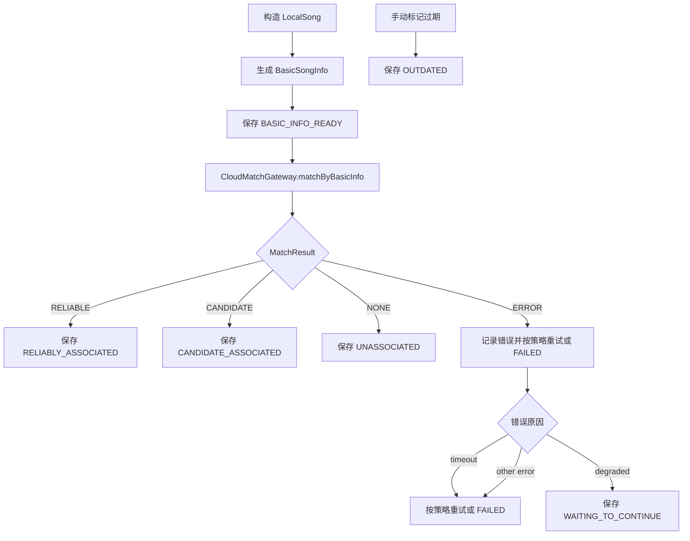

# MVP-1 详细开发计划：客户端 Mock 闭环骨架

## 1. 目标与非目标

### 1.1 目标

MVP-1 目标是在不依赖真实云端、不扫描真实音乐文件、不接入音频指纹和模型的前提下，完成 Android 客户端核心闭环骨架。

MVP-1 完成后应具备：

- 可构造本地歌曲输入。
- 可通过 `CloudMatchGateway` 抽象执行基础信息 Mock 匹配。
- 可覆盖 reliable、candidate、none、error、timeout、degrade 等主要分支，并支持手动标记 `OUTDATED`。
- 可保存处理状态和结果。
- 可通过 ResultProvider 向搜索、推荐、播放等调用方查询当前业务结果。
- `demo` 可选择 Mock 场景并展示处理结果。

### 1.2 非目标

MVP-1 不做：

- 真实本地音乐扫描。
- `MediaStore`、`MediaMetadataRetriever` 接入。
- 音频解码。
- 音频指纹生成。
- Chromaprint / JNI / NDK 接入。
- YAMNet / VGGish / TFLite 接入。
- Room 数据库正式落地。
- 真实云端接口。
- 真实搜索、推荐排序集成。

## 2. 模块拆分

### 2.1 `core` 模块

`core` 承载 SDK 核心能力，MVP-1 建议按职责拆分为以下包或等价结构：

| 职责 | 建议包 | 内容 |
| --- | --- | --- |
| 领域模型 | `com.orion.blaster.core.model` | 本地歌曲、基础信息、匹配结果、状态、调用方结果 |
| 网关接口 | `com.orion.blaster.core.gateway` | `CloudMatchGateway` 抽象 |
| Mock 实现 | `com.orion.blaster.core.mock` | `MockCloudMatchGateway`、Mock 规则、Mock 场景 |
| 处理漏斗 | `com.orion.blaster.core.pipeline` | `FeaturePipeline` 或等价编排类 |
| 结果查询 | `com.orion.blaster.core.result` | `ResultProvider` |
| 存储抽象 | `com.orion.blaster.core.store` | `FeatureRepository`、内存实现 |
| 诊断 | `com.orion.blaster.core.diagnostics` | 处理原因、错误、耗时和测试诊断信息 |

MVP-1 存储使用内存实现即可，接口需要为后续 Room 替换留出边界。

### 2.2 `demo` 模块

`demo` 用于验证 MVP-1 闭环，不承担 SDK 逻辑。

需要提供：

- Mock 场景选择入口。
- 构造本地歌曲输入。
- 调用 pipeline 启动处理。
- 调用 ResultProvider 查询结果。
- 展示 lifecycle state、match result、cloud candidate、last reason。

## 3. 核心领域模型

MVP-1 需要定义最小模型集合。字段可按工程实现微调，但语义必须保持一致。

### 3.1 本地歌曲与基础信息

- `LocalSong`
  - `localSongId`
  - `title`
  - `artist`
  - `album`
  - `durationMs`
  - `sourceState`

- `BasicSongInfo`
  - `localSongId`
  - `title`
  - `artist`
  - `album`
  - `durationMs`

MVP-1 中 `BasicSongInfo` 来自构造数据，不来自真实文件解析。

### 3.2 匹配结果

- `MatchResult`
  - `RELIABLE`
  - `CANDIDATE`
  - `NONE`
  - `ERROR`

`TIMEOUT`、`DEGRADED` 属于调用层诊断原因，不属于匹配语义枚举。MVP-1 中统一通过 `ERROR` 携带 `rejectReason` 或诊断原因表达。

- `CloudAssociation`
  - 云端歌曲标识。
  - 来源阶段：基础信息或音频识别。
  - 置信度语义：可靠或候选。

- `CloudCandidate`
  - 候选云端歌曲标识。
  - 候选原因。
  - 分数可选，MVP-1 不用于决策。

- `MatchResponse`
  - `result`
  - `association`
  - `candidates`
  - `rejectReason`

### 3.3 生命周期状态

MVP-1 必须覆盖以下状态：

- `DISCOVERED`
- `BASIC_INFO_READY`
- `BASIC_MATCHING`
- `RELIABLY_ASSOCIATED`
- `CANDIDATE_ASSOCIATED`
- `UNASSOCIATED`
- `WAITING_TO_CONTINUE`
- `OUTDATED`
- `SKIPPED`
- `FAILED`

以下状态可先定义但不在 MVP-1 主流程中真实执行：

- `AUDIO_IDENTIFYING`
- `AUDIO_MATCHING`
- `LOCAL_FEATURE_EXTRACTING`
- `LOCAL_FEATURE_READY`

### 3.4 调用方结果

`LocalSongResult` 对外表达调用方可消费结果：

- `localSongId`
- `lifecycleState`
- `association`
- `candidates`
- `localFeature`
- `lastReason`
- `updatedAtMs`

MVP-1 中 `localFeature` 恒为空。

## 4. CloudMatchGateway 与 MockCloudMatchGateway

### 4.1 网关接口

MVP-1 需要定义统一接口：

```kotlin
interface CloudMatchGateway {
    suspend fun matchByBasicInfo(request: BasicInfoMatchRequest): MatchResponse
    suspend fun matchByAudioIdentity(request: AudioIdentityMatchRequest): MatchResponse
}
```

MVP-1 只真实调用 `matchByBasicInfo`。

`matchByAudioIdentity` 可提供 Mock 占位实现，返回 `NONE`、`ERROR` 或测试指定结果，但不接入真实音频识别。

### 4.2 Mock 规则

`MockCloudMatchGateway` 支持规则驱动：

- `localSongId`
- `titleContains`
- `artistContains`
- `forceScenario`

匹配规则：

- 规则按顺序 first-match。
- 多个匹配条件同时存在时必须全部满足。
- 没有规则命中时默认返回 `NONE`。
- `forceScenario` 仅用于测试和 demo，不进入真实服务实现。

### 4.3 必须支持的 Mock 场景

- `RELIABLE`：返回可靠云端关联。
- `CANDIDATE`：返回候选关联，不可被强消费。
- `NONE`：无匹配，进入未关联或后续占位路径。
- `ERROR`：模拟服务异常。
- `TIMEOUT`：模拟超时。
- `DEGRADED`：模拟服务降级或能力关闭。

## 5. FeaturePipeline 状态流转

### 5.1 MVP-1 主流程



### 5.2 状态规则

- `RELIABLE` 结果必须保存为 `RELIABLY_ASSOCIATED`。
- `CANDIDATE` 结果必须保存为 `CANDIDATE_ASSOCIATED`，不得提升为可靠关联。
- `NONE` 在 MVP-1 中保存为 `UNASSOCIATED`，后续 MVP 可继续进入音频识别。
- `ERROR` 需要记录失败原因，技术错误需要记录 retry count。
- 超过最大重试次数后保存为 `FAILED`。
- `rejectReason = timeout` 时按技术异常处理，可重试。
- `rejectReason = degraded` 时按能力降级处理，统一保存为 `WAITING_TO_CONTINUE`。
- `OUTDATED` 用于验证版本升级或 schema 升级后的过期语义。
- MVP-1 的 `OUTDATED` 仅通过 `FeatureRepository.markOutdated(localSongId)` 手动触发，不实现自动版本检测，`MockCloudMatchGateway` 不直接返回 `OUTDATED`。

### 5.3 重试与降级最小规则

- MVP-1 支持可配置最大重试次数，默认 2 次。
- 技术异常和超时可重试。
- `NONE` 不消耗技术失败重试次数。
- 用户关闭、策略不允许、能力降级不按技术失败处理。
- 每次失败必须记录 `lastReason`。

## 6. ResultProvider 对外语义

### 6.1 查询能力

MVP-1 需要提供：

- 按 `localSongId` 查询单首结果。
- 批量查询多个 `localSongId` 的结果。
- 查询是否可靠关联云端歌曲。
- 查询是否处于处理中、失败、跳过、过期。

### 6.2 状态映射

| LifecycleState | 调用方视角 |
| --- | --- |
| `DISCOVERED` | 处理中，结果未完成 |
| `BASIC_INFO_READY` | 处理中，结果未完成 |
| `BASIC_MATCHING` | 处理中，结果未完成 |
| `RELIABLY_ASSOCIATED` | 已可靠关联，可继承云端歌曲能力 |
| `CANDIDATE_ASSOCIATED` | 仅候选关联，默认不可强展示或强推荐 |
| `UNASSOCIATED` | 未关联云端歌曲 |
| `WAITING_TO_CONTINUE` | 待继续处理，当前结果未完成 |
| `OUTDATED` | 结果过期，等待重算 |
| `SKIPPED` | 已跳过，调用方可读取原因 |
| `FAILED` | 处理失败，调用方可读取原因 |

MVP-1 不应对外返回 `LOCAL_FEATURE_READY`，除非只是作为未使用状态枚举存在。

## 7. 本地存储最小实现

### 7.1 存储接口

MVP-1 需要定义 `FeatureRepository` 或等价接口，支持：

- 保存本地歌曲。
- 保存基础信息。
- 保存匹配结果。
- 保存生命周期状态。
- 保存 retry count、last reason、updatedAt。
- 查询单首和批量结果。
- 标记结果为 `OUTDATED`。

### 7.2 MVP-1 存储实现

MVP-1 使用内存存储实现：

- 便于单元测试。
- 避免在骨架阶段引入 Room schema 迁移。
- 后续 MVP 可用 Room 实现替换接口，不改变 pipeline 和 ResultProvider 主逻辑。

### 7.3 数据一致性要求

- 同一 `localSongId` 的新结果覆盖旧结果。
- 可靠关联结果优先级高于候选关联结果。
- 候选关联可以保存 candidates，但不得写入可靠 association。
- `OUTDATED` 不删除旧诊断信息，但对调用方显示为过期。

## 8. Demo 验证入口

### 8.1 页面能力

`demo` 最小页面需要支持：

- 选择 Mock 场景。
- 输入或选择构造歌曲。
- 触发处理。
- 提供“标记过期”操作，用于手动触发 `OUTDATED` 场景。
- 展示 ResultProvider 查询结果。
- 展示 lifecycle state、association、candidates、last reason。

### 8.2 Demo 场景

必须支持：

- reliable 命中。
- candidate 命中。
- none 未命中。
- error 异常。
- timeout 超时。
- degrade 降级。
- 手动标记 outdated 过期。

Demo 不需要真实扫描设备音乐库。

## 9. 单元测试清单

### 9.1 领域模型测试

- `RELIABLE` 可映射为可靠关联。
- `CANDIDATE` 不可映射为可靠关联。
- `NONE` 与 `ERROR` 语义区分。
- `NONE` 不消耗 retry count，`ERROR` 中的技术错误消耗 retry count。
- `OUTDATED` 与 `WAITING_TO_CONTINUE` 语义区分。

### 9.2 Mock 网关测试

- first-match 规则生效。
- 多条件规则必须全部满足。
- 无规则命中返回 `NONE`。
- `forceScenario` 可强制 reliable、candidate、none、error、timeout、degrade。
- timeout 可被 pipeline 识别为可重试失败。
- Mock 网关不直接返回 `OUTDATED`。

### 9.3 Pipeline 测试

- reliable 流转到 `RELIABLY_ASSOCIATED`。
- candidate 流转到 `CANDIDATE_ASSOCIATED`。
- none 流转到 `UNASSOCIATED`。
- error / timeout 记录原因并重试。
- 超过最大重试次数流转到 `FAILED`。
- degrade 流转到 `WAITING_TO_CONTINUE`。
- 标记过期后流转到 `OUTDATED`。

### 9.4 ResultProvider 测试

- 单首查询返回最新结果。
- 批量查询返回每首歌曲结果。
- candidate 不被标记为可继承云端能力。
- failed / skipped / outdated 可读取原因。

## 10. 集成测试清单

- 构造歌曲 -> Mock reliable -> ResultProvider 查询可靠关联。
- 构造歌曲 -> Mock candidate -> ResultProvider 查询候选关联。
- 构造歌曲 -> Mock none -> ResultProvider 查询未关联。
- 构造歌曲 -> Mock error -> 重试后 failed 或恢复。
- 构造歌曲 -> Mock timeout -> 重试后 failed 或恢复。
- 构造歌曲 -> Mock degrade -> waiting。
- 已有结果 -> 标记 outdated -> ResultProvider 查询过期。
- demo 页面可手动切换以上场景并展示结果。

## 11. 验收标准

MVP-1 完成必须满足：

- 不依赖真实云端即可跑通客户端 Mock 闭环。
- 不依赖真实本地歌曲扫描即可构造歌曲并处理。
- `CloudMatchGateway` 抽象稳定，Mock 与未来真实实现可共用语义模型。
- `MockCloudMatchGateway` 覆盖 reliable、candidate、none、error、timeout、degrade。
- `OUTDATED` 仅通过 `FeatureRepository.markOutdated(localSongId)` 手动触发。
- ResultProvider 能区分可靠关联、候选关联、未关联、等待、失败、跳过、过期。
- 候选关联不会被标记为可继承云端能力。
- 本地存储接口可被后续 Room 实现替换。
- Demo 可展示所有 MVP-1 Mock 场景。
- 构建验证通过：`./gradlew :core:assemble :demo:assembleDebug`。
- 若已引入单元测试任务，对应单元测试通过。

## 12. 执行拆分（5 个里程碑）

在不改变 MVP-1 范围的前提下，执行按以下 5 个里程碑推进。每个里程碑都要求“实现 + 测试”闭环后再进入下一步。

进度标记：

- [x] 里程碑 1：领域模型与状态基线（已完成）
- [x] 里程碑 2：网关抽象与 Mock 匹配（已完成）
- [x] 里程碑 3：存储抽象与内存实现（已完成）
- [x] 里程碑 4：Pipeline 编排与 ResultProvider（已完成）
- [x] 里程碑 5：Demo 接入与最终验收（已完成）

### 12.1 里程碑 1：领域模型与状态基线

产出：

- `LocalSong`、`BasicSongInfo`、`MatchResponse`、`LocalSongResult`、`LifecycleState`、`MatchResult`。
- 规则固化：`CANDIDATE` 不可提升；`degraded -> WAITING_TO_CONTINUE`；`OUTDATED` 仅 `markOutdated` 触发。

完成标准：

- 模型可编译，状态语义在命名和注释中可读。
- 领域模型测试覆盖 `RELIABLE/CANDIDATE/NONE/ERROR` 与 `OUTDATED vs WAITING_TO_CONTINUE`。

### 12.2 里程碑 2：网关抽象与 Mock 匹配

产出：

- `CloudMatchGateway` 接口。
- `MockCloudMatchGateway`（first-match 规则、规则条件、场景模拟）。

完成标准：

- 支持 `RELIABLE/CANDIDATE/NONE/ERROR/TIMEOUT/DEGRADED` 六类场景。
- `MockCloudMatchGateway` 不直接返回 `OUTDATED`。
- Mock 规则测试覆盖：first-match、多条件全满足、无命中 `NONE`，以及 `forceScenario` 对 `RELIABLE/CANDIDATE/NONE/ERROR/TIMEOUT/DEGRADED` 六类场景的强制覆盖。

### 12.3 里程碑 3：存储抽象与内存实现

产出：

- `FeatureRepository` 接口与内存实现。
- 支持保存歌曲/基础信息/匹配/状态/retry/reason/updatedAt，单查/批查，`markOutdated`。

完成标准：

- 同 `localSongId` 覆盖策略生效。
- candidate 不写 reliable association。
- Repository 测试覆盖写入、批量查询、`markOutdated`、优先级约束。

### 12.4 里程碑 4：Pipeline 编排与 ResultProvider

产出：

- `FeaturePipeline` 与 `ResultProvider`。
- 流转行为：`BASIC_INFO_READY -> BASIC_MATCHING -> 终态`，错误重试（默认 2），`lastReason` 记录，对外状态映射。

完成标准：

- 6 类输入路径 + `markOutdated` 路径可闭环查询。
- Pipeline/Provider 测试覆盖状态流转、retry 上限、candidate 不强消费、原因可读。

### 12.5 里程碑 5：Demo 接入与最终验收

产出：

- demo 支持场景切换、构造歌曲、触发处理、手动标记过期、结果展示。

完成标准：

- 集成测试覆盖 reliable/candidate/none/error/timeout/degraded/outdated（手动标记）全链路。
- 构建验证通过：`./gradlew :core:assemble :demo:assembleDebug`。
- 文档定义的 MVP-1 场景在 demo 可见且语义一致。

## 13. 与后续 MVP 的交接

MVP-1 需要为后续阶段保留接口边界：

- MVP-2 替换构造歌曲输入为真实扫描结果，不改变 ResultProvider 语义。
- MVP-2 将真实基础信息提交给同一个 `CloudMatchGateway.matchByBasicInfo`。
- MVP-3 在 `UNASSOCIATED` 或 `CANDIDATE_ASSOCIATED` 后接入音频识别，不改变可靠/候选消费规则。
- MVP-4 在未可靠关联后接入本地特征，不改变云端关联语义。
