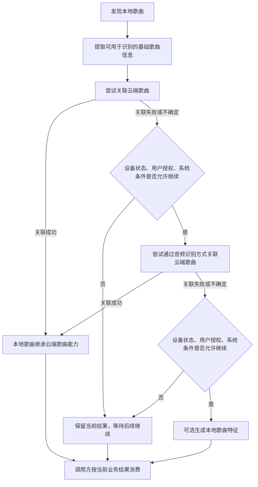

# Android 本地音乐特征能力与云端歌曲绑定 PRD v0.1

## 1. 背景与问题

当前音乐体验中，本地歌曲和云端歌曲通常处在两套能力体系中：云端歌曲具备完整的搜索、推荐、标签、相似歌曲等能力，而本地歌曲往往只能被简单展示或按基础信息检索，难以进入统一的搜索和推荐链路。

这会带来几个业务问题：

- 用户本地已有歌曲无法充分参与搜索和推荐，体验割裂。
- 本地歌曲与云端同一首歌无法稳定关联，容易出现重复展示或能力缺失。
- 推荐系统难以理解本地歌曲，无法把本地歌曲作为有效候选。
- 搜索和推荐入口无法对本地歌曲与云端歌曲进行统一召回、统一排序和统一展示。

本 PRD 目标是定义一套业务能力：让 Android 端可访问的本地歌曲进入统一的歌曲理解和绑定流程，尽可能关联到云端歌曲；无法关联时，也能生成可用于搜索推荐兜底的本地歌曲特征。

## 2. 业务目标

### 2.1 核心目标

- 支撑本地歌曲与云端歌曲的混合搜索。
- 支撑本地歌曲与云端歌曲的混合推荐。
- 提升本地歌曲在搜索、推荐、相似歌曲等场景中的可用性。
- 尽量将本地歌曲绑定到云端歌曲，使本地歌曲继承云端已有能力。
- 对无法绑定的本地歌曲，提供本地特征能力作为搜索推荐兜底。

### 2.2 体验目标

- 用户能在同一搜索入口中获得本地歌曲和云端歌曲结果。
- 用户能在推荐场景中看到符合偏好的本地歌曲和云端歌曲。
- 本地已有歌曲与云端同一歌曲应尽量合并或关联，避免重复和割裂。
- 处理本地歌曲的过程不得明显影响播放、搜索、推荐和设备使用体验。

### 2.3 质量原则

误绑定率优先于绑定成功率。宁可少绑定，也不能把本地歌曲错误关联到不对应的云端歌曲，避免污染搜索、推荐和播放体验。

## 3. 用户与调用方

### 3.1 用户

- 拥有本地音乐文件的 Android 用户。
- 希望本地歌曲和云端歌曲在搜索、推荐、播放体验中保持一致的用户。

### 3.2 业务调用方

- 搜索：需要将本地歌曲纳入统一搜索召回和展示。
- 推荐：需要将本地歌曲纳入推荐候选、相似歌曲和场景推荐。
- 播放：需要识别本地歌曲与云端歌曲的关联关系，减少重复和错误跳转。
- 内容运营：需要了解本地歌曲能力覆盖和绑定质量。
- 数据与质量分析：需要评估覆盖率、绑定质量和体验影响。

## 4. 业务范围

### 4.1 本期包含

- 发现用户可访问的本地歌曲，并将其纳入能力处理范围。
- 提取本地歌曲可用于识别、绑定和推荐的必要信息。
- 优先尝试将本地歌曲关联到云端歌曲。
- 当基础信息不足以完成可靠关联时，进入更高成本的歌曲识别流程。
- 当仍无法关联云端歌曲时，可选择生成本地歌曲特征，用于搜索和推荐兜底。
- 为搜索和推荐调用方提供本地歌曲是否可用、是否已关联云端歌曲、是否具备本地特征等业务结果。
- 定义覆盖率、绑定成功率、误绑定率、处理成功率、体验影响等业务指标。

### 4.2 本期不包含

- 搜索排序模型的具体实现。
- 推荐排序模型的具体实现。
- 云端歌曲库建设方案。
- 具体端侧技术方案、算法选型、协议字段、数据库设计、状态机设计。
- 具体 UI 展示样式。
- 音乐模型训练方案。

## 5. 业务流程

### 5.1 总体流程

本地歌曲进入业务处理后，按由低成本到高成本的顺序逐级处理：

### 5.2 预期漏斗分布

`80/15/5` 仅作为预期漏斗分布示意，不是硬性配额，也不应通过限流强行达成：

- 约 80%：通过基础歌曲信息完成云端歌曲关联。
- 约 15%：通过更高成本的音频识别方式完成云端歌曲关联。
- 约 5%：无法可靠关联云端歌曲，使用本地歌曲特征作为搜索推荐兜底。

实际比例应以后续数据评估为准。

### 5.3 业务分流原则

- 如果前一层已经能可靠关联云端歌曲，应结束流程，不再执行更高成本处理。
- 如果前一层结果不可靠，应进入下一层，而不是强行绑定。
- 如果设备状态、用户授权或系统条件不允许继续处理，应保留已获得结果，并允许后续继续。
- 如果最终无法关联云端歌曲，也应给出明确的业务结果，避免调用方无法判断。

## 6. 能力需求

### 6.1 本地歌曲发现

系统应能够发现用户可访问的本地歌曲，并识别哪些歌曲需要进入处理范围。

业务要求：

- 新增本地歌曲应能进入处理流程。
- 已处理且未变化的歌曲不应反复触发高成本处理。
- 无法访问、无权限或已删除的歌曲应能被识别并从可用范围中剔除。
- 处理范围应可被业务策略控制，避免一次性处理过多歌曲影响体验。

### 6.2 本地歌曲基础信息能力

系统应从本地歌曲中获得可用于识别和关联的基础歌曲信息。

业务要求：

- 基础信息应优先用于低成本关联云端歌曲。
- 基础信息缺失、错误、乱码或存在歧义时，不应直接强绑定。
- 播放器本地曲库记录可作为可选信息来源；没有该来源时，流程仍应可继续。

### 6.3 云端歌曲关联能力

系统应支持将本地歌曲与云端歌曲进行关联。

本节中的“可靠关联”“候选关联”“未关联”为业务状态占位。具体判定标准由业务、算法、搜索推荐和 QA 在后续评审中联合确认；在标准确认前，只有经评审认可的可靠关联结果才能影响强展示、强推荐和合并展示。

业务要求：

- 关联成功后，本地歌曲可以继承云端歌曲的搜索、推荐、标签、相似歌曲等能力。
- 关联结果应能区分可靠关联、候选关联、未关联。
- 只有可靠关联才能影响强搜索、强推荐和合并展示。
- 候选关联可以用于分析或实验，不应默认影响强展示和强推荐。
- 无法关联时，应进入后续识别或本地特征兜底流程。

### 6.4 音频识别兜底能力

当基础歌曲信息无法可靠关联云端歌曲时，系统应支持进入更高成本的音频识别流程。

业务要求：

- 音频识别用于判断本地歌曲是否与云端歌曲库中的某首歌一致或高度相似。
- 音频识别结果仍应遵循“可靠关联优先、避免误绑定”的原则。
- 音频识别能力可以受设备条件、用户授权、系统状态和业务开关控制。
- 音频识别不可用时，流程应能降级，不影响已获得的基础信息结果。

### 6.5 本地歌曲特征兜底能力

当本地歌曲无法可靠关联云端歌曲时，系统可选择生成本地歌曲特征，用于搜索和推荐兜底。

业务要求：

- 本地歌曲特征应服务于搜索召回、推荐召回、相似歌曲、标签补全等场景。
- 该能力应可由调用方或业务策略控制是否启用。
- 关闭本地特征兜底能力时，不应影响前置的歌曲发现和云端关联能力。
- 本地特征结果不应被误认为云端歌曲关联结果。

### 6.6 体验保护

处理本地歌曲的过程应避免明显影响用户体验。

业务要求：

- 不应明显影响当前播放体验。
- 不应明显影响搜索和推荐响应。
- 不应在用户敏感场景中造成明显耗电、发热或卡顿。
- 用户或业务策略应能关闭高成本能力。
- 失败、暂停或跳过时，应保留可解释的业务结果，便于后续继续或分析。

## 7. 搜索与推荐消费需求

### 7.1 混合搜索

搜索侧需要能够消费本地歌曲处理结果，并实现本地歌曲与云端歌曲的统一搜索体验。

业务要求：

- 已可靠关联云端歌曲的本地歌曲，应可继承云端歌曲的搜索能力。
- 未关联但具备本地特征的歌曲，应可作为本地结果参与搜索兜底。
- 搜索结果应能识别本地歌曲、云端歌曲以及二者的关联关系。
- 本地歌曲与云端同一歌曲应尽量避免重复展示。

### 7.2 混合推荐

推荐侧需要能够消费本地歌曲处理结果，并将本地歌曲纳入推荐候选。

业务要求：

- 已可靠关联云端歌曲的本地歌曲，应可继承云端歌曲推荐能力。
- 未关联但具备本地特征的歌曲，应可作为本地推荐候选。
- 推荐侧应能区分可靠关联歌曲和仅具备本地特征的歌曲。
- 本地歌曲进入推荐不应降低推荐结果质量和用户体验。

### 7.3 相似歌曲与标签补全

相似歌曲和标签补全场景需要能够消费本地歌曲处理结果，但不得把不可靠结果当作云端关联结果使用。

业务要求：

- 已可靠关联云端歌曲的本地歌曲，应可继承云端歌曲的相似歌曲和标签能力。
- 未关联但具备本地特征的歌曲，可作为相似歌曲和标签补全的兜底输入。
- 候选关联结果只能用于分析或实验，不应默认影响用户可见的强展示能力。
- 本地特征生成的标签，应与云端继承能力区分，避免误导调用方。

## 8. 指标与验收

本章指标为完整能力口径。MVP 范围确认后，需要明确哪些指标进入 MVP 验收，哪些指标仅作为完整版或后续阶段的观测指标。

### 8.1 覆盖率

衡量有多少可访问本地歌曲进入能力范围。

建议口径：

- 可访问本地歌曲进入处理范围的比例。
- 至少完成一层处理并产出业务结果的比例。
- 不同用户、不同设备、不同本地曲库规模下的覆盖表现。

### 8.2 绑定成功率

衡量有多少本地歌曲成功关联到云端歌曲。

建议口径：

- 整体绑定成功率。
- 通过基础歌曲信息完成绑定的比例。
- 通过音频识别完成绑定的比例。

绑定成功率不应单独作为质量目标，必须与误绑定率一起评估。

### 8.3 误绑定率

衡量本地歌曲被错误关联到云端歌曲的比例。

建议口径：

- 对可靠关联结果进行抽样评估。
- 错误关联包括同名不同歌、错误歌手、错误版本、翻唱/现场/伴奏/remix 误关联等。
- 误绑定率是核心质量红线，优先级高于绑定成功率。

### 8.4 处理成功率

衡量业务流程能否完成并给出可消费结果。

建议口径：

- 本地歌曲是否能得到明确的业务结果：已关联、未关联但有本地特征、无法处理、已跳过。
- 云端能力不可用时，端侧是否能保留已有结果并降级。
- 高成本能力关闭时，前置流程是否仍能正常工作。

### 8.5 体验影响

衡量本地歌曲处理是否影响用户体验。

建议口径：

- 播放过程中无明显卡顿或中断。
- 搜索和推荐响应无明显退化。
- 处理过程不造成用户可感知的异常耗电、发热或卡顿。
- 用户或业务策略关闭高成本能力后，相关处理应停止或降级。

### 8.6 搜索推荐效果

衡量该能力是否真正支撑混合搜索和混合推荐。

评估方式可包括上线实验、人工抽样、离线分析和搜索推荐侧专项评审；具体评估方案在后续 Tech Design 或实验方案中明确。

建议口径：

- 本地歌曲是否能进入混合搜索结果。
- 本地歌曲是否能进入混合推荐候选。
- 已关联本地歌曲是否能继承云端歌曲能力。
- 未关联但具备本地特征的歌曲是否能作为兜底候选。
- 重复展示、错误关联和低质量推荐是否可控。

## 9. 验收场景

产品/业务作为整体验收主责，负责确认业务目标、范围和上线口径。搜索、推荐、云端、客户端、QA 和数据分别对各自相关场景提供验收输入、测试结果或质量确认。

### 9.1 基础关联场景

- 本地歌曲信息完整且准确时，应能可靠关联到云端歌曲。
- 本地歌曲信息缺失、错误或存在歧义时，不应直接强绑定。
- 同名不同歌不应仅凭基础信息被错误关联。

### 9.2 音频识别场景

- 基础信息无法可靠关联时，系统应能进入更高成本识别流程。
- 音频识别确认与云端歌曲一致时，应能完成可靠关联。
- 音频识别无法确认时，不应强行绑定。

### 9.3 本地特征兜底场景

- 无法关联云端歌曲时，若本地特征能力启用，应能产出搜索推荐可用结果。
- 本地特征能力关闭时，流程应能以“未关联”业务结果结束。
- 本地特征结果不得被误认为云端关联结果。

### 9.4 搜索推荐消费场景

- 搜索侧能识别本地歌曲是否已关联云端歌曲。
- 推荐侧能识别本地歌曲是否具备推荐可用能力。
- 已关联歌曲可继承云端歌曲能力。
- 未关联歌曲可按本地特征能力进入兜底。

### 9.5 体验保护场景

- 播放中处理本地歌曲不应明显影响播放体验。
- 高成本能力关闭后，不应继续执行对应处理。
- 处理失败或中断后，应保留可解释的业务结果。

## 10. 依赖与风险

### 10.1 业务依赖

- 搜索侧需要支持消费本地歌曲与云端歌曲关联结果。
- 推荐侧需要支持消费本地歌曲与本地特征结果。
- 云端需要支持本地歌曲关联所需的曲库匹配和候选确认能力。
- 客户端需要支持在用户体验可接受的前提下完成本地歌曲处理。
- 数据和 QA 需要在 MVP 前支持误绑定率、覆盖率、处理成功率等评估方案，并在上线后持续支持质量监控。

### 10.2 风险

- 本地歌曲信息质量差，会降低低成本关联成功率。
- 错误关联会污染搜索、推荐和播放体验。
- 用户本地曲库规模和质量差异大，覆盖率和处理成本可能波动。
- 云端关联能力未就绪时，端侧只能完成部分业务验证。
- 高成本识别和本地特征能力可能带来体验、隐私和合规风险。
- 涉及本地音乐内容识别时，必须遵循用户授权、必要提示、最小化处理和合规评审原则。
- 是否存在超出本地范围的数据处理，需要在产品和合规侧确认后才能上线。

## 11. 非目标

- 本 PRD 不定义具体 Android 实现方式。
- 本 PRD 不定义具体云端接口字段。
- 本 PRD 不定义指纹算法、模型算法或推理框架。
- 本 PRD 不定义数据库、状态机、后台调度和版本管理方案。
- 本 PRD 不定义搜索和推荐排序模型。
- 本 PRD 不定义 UI 展示样式。

## 12. 后续 Tech Design 待办

以下问题应在技术方案阶段解决，不在 PRD 中展开：

- 端侧歌曲发现、信息提取和去重方案。
- 端侧与云端的匹配结果协议。
- 置信度分级与端侧行为映射。
- 音频识别算法选型与可插拔设计。
- 本地歌曲特征能力的具体输出和模型策略。
- 端侧存储、状态机、错误码和版本管理。
- 高成本能力的调度、降级和体验保护策略。
- 云端服务不可用时的模拟服务与联调方案。
- 指标采集、抽样评估和质量看板设计。
- 用户授权、隐私提示、数据上传边界和合规评审方案。

## 13. 待确认项

- MVP 是否包含本地歌曲特征兜底能力，或仅做到云端关联能力。建议决策方：产品、搜索推荐、客户端。
- 首批接入哪些搜索和推荐入口。建议决策方：产品、搜索、推荐。
- 可靠关联、候选关联、未关联的业务判定标准。建议决策方：业务、算法、搜索推荐、QA。
- 误绑定率的抽样评估方式和验收阈值。建议决策方：QA、数据、业务、算法。
- 用户授权、隐私提示和能力开关的产品要求。建议决策方：产品、法务/合规、客户端。
- 云端曲库匹配和候选确认能力的交付节奏。建议决策方：云端、项目管理、客户端。
- 本地特征是否支持相似歌曲能力，或仅用于标签补全和推荐兜底。建议决策方：产品、搜索推荐、算法。
