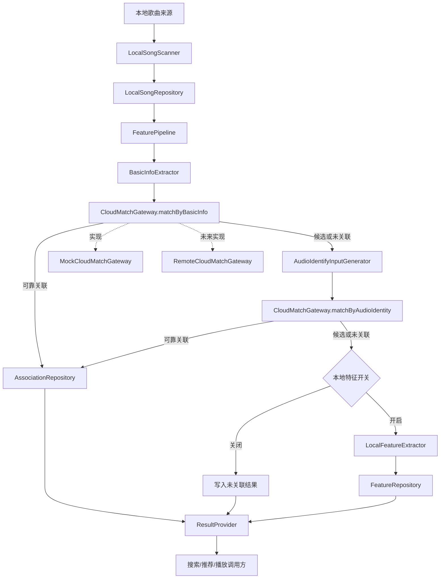
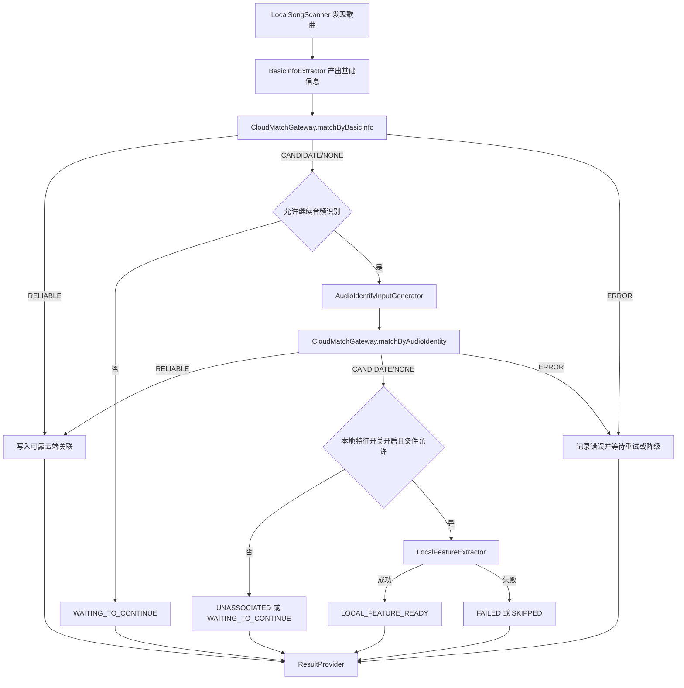
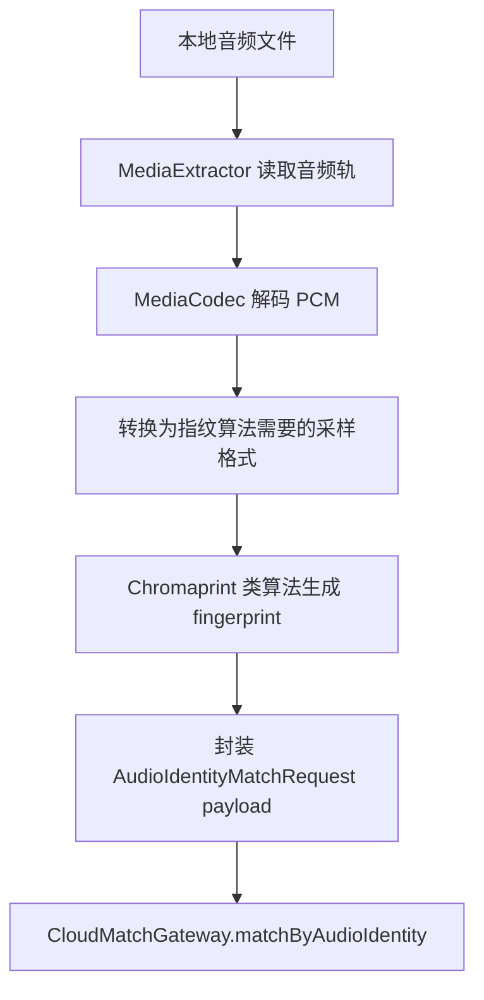

# Android 本地音乐特征能力与云端歌曲绑定 Tech Design v0.1

## 1. 背景与目标

本文档承接 `prd-v0.1.md`，定义 Android 客户端实现本地歌曲处理漏斗的技术方案。目标是在真实服务端未就绪前，客户端也能通过 Mock 服务端完整开发、联调和测试。

核心目标：

- 明确客户端、服务端、调用方职责边界。
- 定义客户端本地歌曲处理漏斗和状态流转。
- 定义 Mock 服务端优先的开发方式。
- 定义本地特征生成方案，模型优先使用预训练模型，不自训练。
- 确保模型 Android 兼容，体积目标不超过 20MB。

## 2. 总体架构



架构原则：

- 客户端处理本地歌曲发现、端侧处理、缓存、调度和调用方查询。
- 服务端处理云端曲库匹配、候选确认和可靠关联判定。
- Mock 服务端与真实服务端共用同一客户端抽象，客户端漏斗逻辑不依赖 mock 专用分支。
- 本地特征能力是兜底能力，不等价于云端歌曲可靠关联。

## 3. 技术选型总览

| 能力 | 首选方案 | 备选方案 | 结论 |
| --- | --- | --- | --- |
| 本地歌曲扫描 | `MediaStore` | App 内已有曲库记录 | 首版使用 `MediaStore`，已有曲库记录作为补充来源 |
| 元数据读取 | `MediaMetadataRetriever` | 文件名兜底解析 | 首版用系统能力读取基础信息，异常时降级文件名 |
| 音频解码 | `MediaExtractor + MediaCodec` | ExoPlayer 解码复用、FFmpeg 兜底 | 首版优先系统解码；FFmpeg 不进首版默认依赖 |
| 音频指纹 | Chromaprint 类方案 | 内部指纹算法 | 首版推荐 `chromaprint-compatible`，通过 JNI/NDK 封装 |
| 本地存储 | Room | SQLite 直连 | 首版使用 Room，底层 SQLite |
| 本地搜索索引 | Room FTS / SQLite FTS5 | 简单 LIKE 查询 | 首版用 FTS 支撑本地搜索兜底 |
| 后台调度 | WorkManager + CoroutineWorker | 自定义后台调度 | 首版使用 WorkManager，运行时再做体验保护判断 |
| 模型推理 | TensorFlow Lite | MNN | 首版用 TFLite，因 YAMNet Android 路径最直接 |
| 预训练模型 | YAMNet TFLite | VGGish | 首版用 YAMNet 验证 embedding；VGGish 作为备选 |

选型原则：

- 优先使用 Android 系统能力，降低包体和兼容风险。
- 首版不引入 FFmpeg 作为默认依赖，除非系统解码无法满足目标格式覆盖。
- 首版不使用 Gemma 作为主链路模型；Gemma 更适合语义解释或 Agent 场景，不适合批量歌曲特征提取主流程。
- 音频指纹算法通过 `algorithm + payload` 抽象保留替换空间。
- 真实服务端未就绪时，全部远端匹配通过 Mock 服务端模拟。

## 4. 职责边界

### 4.1 客户端职责

- 发现用户可访问的本地歌曲。
- 提取用于识别和关联的基础信息。
- 识别本地歌曲变更，避免重复高成本处理。
- 生成音频识别所需的端侧输入。
- 在开关允许时生成本地歌曲特征。
- 管理本地处理状态、缓存和结果。
- 控制调度、降级和体验保护。
- 向搜索、推荐、播放等调用方提供查询能力。
- 记录指标、错误和本地诊断信息。

### 4.2 服务端职责

- 基于基础信息匹配云端曲库。
- 基于音频识别结果匹配云端曲库。
- 判定可靠关联、候选关联、未关联。
- 返回云端歌曲标识、候选信息、关联结果和拒绝原因。
- 支持误绑定评估、覆盖率分析和质量看板。

### 4.3 边界原则

- 客户端不维护完整云端曲库。
- 客户端不决定最终可靠关联标准。
- 客户端不把候选关联当作可靠关联强行消费。
- 服务端不访问用户本地文件。
- 服务端不负责端侧扫描、调度、缓存和体验保护。
- 真实服务端未就绪时，客户端通过 Mock 服务端完成完整开发和测试。

## 5. 客户端模块设计

### 5.1 LocalSongScanner

负责发现本地歌曲并产出本地歌曲条目。

职责：

- 通过 `MediaStore` 扫描可访问本地歌曲。
- 识别新增、删除、变更歌曲。
- 产出基础歌曲条目并写入本地仓库。
- 对无法访问或权限不足的歌曲记录跳过原因。

### 5.2 BasicInfoExtractor

负责从本地歌曲中提取用于低成本关联的基础信息。

职责：

- 通过 `MediaMetadataRetriever` 和 `MediaStore` 提取标题、歌手、专辑、时长、文件描述等基础信息。
- 当系统元数据缺失或异常时，使用文件名兜底解析。
- 对缺失、乱码、冲突信息做标准化标记。
- 产出基础信息匹配请求所需的数据对象。

### 5.3 CloudMatchGateway

客户端访问云端匹配能力的统一抽象。

```kotlin
interface CloudMatchGateway {
    suspend fun matchByBasicInfo(request: BasicInfoMatchRequest): MatchResponse
    suspend fun matchByAudioIdentity(request: AudioIdentityMatchRequest): MatchResponse
}
```

实现：

- `MockCloudMatchGateway`：前期默认实现，用于完整客户端开发测试。
- `RemoteCloudMatchGateway`：真实服务端接入后实现。

约束：

- 客户端业务逻辑只依赖 `CloudMatchGateway`。
- Mock 和真实服务端返回同一语义模型。
- 切换实现不应改动主漏斗逻辑。

### 5.4 AudioIdentifyInputGenerator

负责在基础信息无法可靠关联时，生成音频识别所需的端侧输入。首版音频识别明确落到“端侧生成音频指纹或兼容摘要，服务端做近似匹配”。

职责：

- 使用 `MediaExtractor + MediaCodec` 将本地音频解码为 PCM，不直接使用压缩文件内容。
- 首版推荐 `algorithm = chromaprint-compatible`。
- 通过 JNI/NDK 封装 Chromaprint 类 C/C++ 指纹库。
- 优先生成较长片段或整首歌曲的音频指纹；短歌按可用长度处理；长音频可截取代表性片段。
- 产出 `AudioIdentityMatchRequest`，外层字段保持稳定，算法相关内容放入 `payload`。
- 遇到格式不支持、权限不足、资源限制时产出可诊断失败结果。

首版截取策略：

- 普通歌曲优先取较长中间片段；如果成本允许，可整首生成指纹。
- 长音频可取多段代表性片段并合并为一个请求 payload。
- 短音频按可用长度处理，不强行补齐。
- 具体片段长度、采样率和算法 payload 格式由音频识别算法选型确定，但请求外层结构先保持稳定。
- 音频指纹不是文件 hash，不对 MP3/AAC/FLAC 文件直接做 MD5。

### 5.5 LocalFeatureExtractor

负责在无法可靠关联云端歌曲时，生成本地搜索推荐可用特征。

职责：

- 在开关允许、设备状态允许、用户授权满足时运行。
- 使用预训练模型生成本地特征。
- 产出本地特征结果并写入 `FeatureRepository`。
- 本地特征结果不得写成云端可靠关联结果。

### 5.6 ResultProvider

负责向搜索、推荐、播放等调用方提供统一查询能力。

能力：

- 查询单首本地歌曲处理结果。
- 查询批量本地歌曲处理结果。
- 查询本地歌曲是否可靠关联云端歌曲。
- 查询本地歌曲是否具备本地特征兜底能力。
- 暴露处理中、已跳过、失败、未关联等业务结果。

对外语义：

| LifecycleState | 调用方视角 |
| --- | --- |
| `RELIABLY_ASSOCIATED` | 已可靠关联，可继承云端歌曲能力 |
| `CANDIDATE_ASSOCIATED` | 未可靠关联，默认不可强展示或强推荐 |
| `LOCAL_FEATURE_READY` | 未关联云端歌曲，具备本地特征兜底 |
| `UNASSOCIATED` | 未关联云端歌曲，且无本地特征兜底 |
| `WAITING_TO_CONTINUE` | 处理中或待继续，结果未完成 |
| `OUTDATED` | 结果已过期，等待重算 |
| `FAILED` / `SKIPPED` | 无可用新结果，调用方可读取原因 |

## 6. 数据模型与状态

### 6.1 关键领域对象

```kotlin
data class LocalSong(
    val localSongId: String,
    val title: String?,
    val artist: String?,
    val album: String?,
    val durationMs: Long?,
    val sourceState: SourceState
)

data class MatchResponse(
    val result: MatchResult,
    val association: CloudAssociation?,
    val candidates: List<CloudCandidate>,
    val rejectReason: String?
)

data class AudioIdentityMatchRequest(
    val localSongId: String,
    val durationMs: Long?,
    val clipPolicy: String,
    val algorithm: String,
    val payloadEncoding: String,
    val payload: ByteArray,
    val basicInfo: BasicSongInfo
)

enum class MatchResult {
    RELIABLE,
    CANDIDATE,
    NONE,
    ERROR
}

data class LocalSongResult(
    val localSongId: String,
    val lifecycleState: LifecycleState,
    val association: CloudAssociation?,
    val localFeature: LocalFeature?,
    val lastReason: String?
)

data class LocalFeature(
    val embedding: FloatArray,
    val modelName: String,
    val modelVersion: String,
    val generatedAtMs: Long
)
```

说明：

- `RELIABLE` 才能作为云端可靠关联结果。
- `CANDIDATE` 只能用于分析或实验，不进入强展示和强推荐。
- `NONE` 表示未关联，可继续下一层或结束。
- `ERROR` 表示服务或处理异常，不等同于未匹配。

### 6.2 生命周期状态

```kotlin
enum class LifecycleState {
    DISCOVERED,
    BASIC_INFO_READY,
    BASIC_MATCHING,
    AUDIO_IDENTIFYING,
    AUDIO_MATCHING,
    LOCAL_FEATURE_EXTRACTING,
    RELIABLY_ASSOCIATED,
    CANDIDATE_ASSOCIATED,
    LOCAL_FEATURE_READY,
    UNASSOCIATED,
    WAITING_TO_CONTINUE,
    OUTDATED,
    SKIPPED,
    FAILED
}
```

状态原则：

- `RELIABLY_ASSOCIATED` 表示可继承云端歌曲能力。
- `CANDIDATE_ASSOCIATED` 不可默认影响强展示和强推荐。
- `WAITING_TO_CONTINUE` 表示设备状态、用户授权或系统条件暂不允许继续。
- `OUTDATED` 表示模型、识别方案、特征 schema 或客户端处理版本升级后，已有结果需要重算。
- `LOCAL_FEATURE_READY` 表示本地特征可用于兜底，但不是云端关联。

## 7. 处理漏斗



漏斗规则：

- 一旦得到 `RELIABLE` 结果，停止后续高成本处理。
- `CANDIDATE` 不能当作 `RELIABLE` 使用。
- 每次收到 `CANDIDATE`，都应保存为候选关联结果，但不阻塞继续后续识别流程。
- 如果后续没有得到 `RELIABLE` 或本地特征结果，最终可呈现为 `CANDIDATE_ASSOCIATED`。
- 调用方不得将 `CANDIDATE_ASSOCIATED` 当作可靠关联消费。
- 服务异常和未匹配需要区分。
- 本地特征开关关闭时，漏斗必须能正常结束。
- 条件不允许继续时，保留当前结果并等待后续继续。

## 8. 音频指纹提取与云端比对

### 8.1 端侧指纹提取

端侧音频指纹用于判断本地歌曲是否与云端曲库中的某首歌一致或高度相似。它不是普通文件 hash，也不用于表达歌曲风格。

处理流程：



端侧输出：

- `algorithm`：首版推荐 `chromaprint-compatible`。
- `payloadEncoding`：用于描述 payload 编码方式。
- `payload`：fingerprint 二进制或编码后内容。
- `durationMs`：歌曲时长。
- `clipPolicy`：指纹片段策略。
- `basicInfo`：基础歌曲信息，辅助服务端判定。

### 8.2 云端指纹比对边界

客户端职责：

- 生成音频指纹 payload。
- 上传最小必要匹配信息。
- 消费 `RELIABLE`、`CANDIDATE`、`NONE`、`ERROR`。
- 不维护完整云端曲库或完整指纹库。

服务端职责：

- 建立云端指纹索引。
- 执行近似匹配和候选召回。
- 结合时长、基础信息、版本冲突等因素精排。
- 判定可靠关联、候选关联、未关联。

Mock 服务端要求：

- 能模拟指纹可靠关联、候选关联、未关联、错误和超时。
- 能模拟同名不同歌、翻唱、现场版、伴奏版、remix 等误绑定风险样本。

## 9. Mock 服务端优先设计

### 9.1 目标

前期真实服务端可以完全未就绪，客户端仍可通过 Mock 服务端完成完整开发、联调和测试。

Mock 必须覆盖：

- 基础信息可靠关联。
- 基础信息候选关联。
- 基础信息未关联。
- 基础信息服务异常。
- 音频识别可靠关联。
- 音频识别候选关联。
- 音频识别未关联。
- 音频识别服务异常。
- 超时、降级、重试场景。

### 9.2 Mock 数据来源

Mock 数据可以来自：

- 本地 JSON 配置。
- 单元测试 fixture。
- 测试构造器。
- Demo 页面手动选择场景。

建议 JSON 形态：

```json
{
  "basicInfoRules": [
    {
      "titleContains": "reliable",
      "result": "RELIABLE",
      "cloudSongId": "cloud_001",
      "reason": "mock basic info reliable"
    }
  ],
  "audioIdentityRules": [
    {
      "localSongId": "local_002",
      "result": "NONE",
      "reason": "mock audio identity none"
    }
  ]
}
```

Mock 规则语义：

- 规则按数组顺序匹配，采用 first-match。
- 支持的匹配维度包括 `localSongId`、`titleContains`、`artistContains`、`forceScenario`。
- 多个匹配字段同时存在时，必须全部满足才算命中。
- 未命中任何规则时，默认返回 `NONE`。
- Mock 必须能构造 `RELIABLE`、`CANDIDATE`、`NONE`、`ERROR`、`TIMEOUT` 场景。
- `forceScenario` 用于测试强制路径，不应出现在真实服务实现中。

### 9.3 Mock 切换原则

- Debug 和测试环境默认使用 `MockCloudMatchGateway`。
- 真实服务端接入后，通过依赖注入或配置切换到 `RemoteCloudMatchGateway`。
- 主漏斗代码不得判断当前是 mock 还是真实服务。
- Mock 与真实服务结果必须映射到同一 `MatchResponse`。

## 10. 客户端/服务端协议方向

本节定义方向，不锁定最终网络协议和字段细节。

基础信息匹配请求应表达：

- 本地歌曲标识。
- 本地歌曲基础信息。
- 可选上下文信息。

音频识别匹配请求应表达：

- 本地歌曲标识。
- 音频时长。
- 截取策略。
- 音频识别算法名。
- payload 编码方式。
- 算法相关 payload。
- 基础歌曲信息。

音频识别请求外层形态建议稳定为 Section 6.1 中定义的 `AudioIdentityMatchRequest`。

说明：

- `localSongId` 用于关联本地歌曲处理状态。
- `durationMs` 用于辅助服务端候选确认。
- `clipPolicy` 描述端侧截取策略。
- `algorithm` 描述当前音频识别输入的算法或方案。
- `payload` 承载算法相关内容，可以是指纹、摘要或其他可匹配特征。
- `payloadEncoding` 用于标识二进制、Base64 或后续协议编码。
- `basicInfo` 提供基础歌曲信息作为辅助匹配依据。
- 具体算法和 payload 内容仍由后续音频识别选型决定。
- 请求外层字段应尽量稳定，避免算法替换影响主漏斗。

匹配响应应表达：

- 结果类型：可靠关联、候选关联、未关联、错误。
- 云端歌曲标识。
- 候选列表。
- 拒绝或降级原因。
- 服务端诊断信息。

最终协议字段、置信度阈值和候选排序规则在服务端技术方案中确认。

## 11. 本地特征模型方案

### 11.1 约束

- 当前没有条件自训练模型。
- 首版不做微调。
- 优先使用预训练模型。
- Android 兼容优先。
- 模型体积目标不超过 20MB。
- 本地特征能力必须可关闭。

### 11.2 推理框架选型

首版默认使用 TensorFlow Lite。

原因：

- YAMNet TFLite 的 Android 接入路径最直接。
- Android 生态支持成熟，适合快速验证预训练模型。
- 可与模型动态下载、delegate 和性能分析工具配套演进。

MNN 作为备选：

- 适用于后续统一内部 AI runtime、性能优化或多模型部署。
- 首版不作为默认方案，避免同时引入模型产物转换和 runtime 适配风险。

Gemma 不作为主链路模型：

- Gemma 更适合语义理解、解释或 Agent 场景。
- 批量本地歌曲 embedding 生成需要稳定、低成本、可版本化的小音频模型。
- 首版不使用 Gemma 做音频特征提取主流程。

### 11.3 推荐模型：YAMNet TFLite

首选 YAMNet TFLite 作为本地 embedding 基线。

原因：

- 有 TensorFlow Lite Android 音频分类示例可参考。
- 面向音频事件分类，Android 接入路径相对清晰。
- 可输出 embedding，适合作为本地歌曲特征兜底的基线。
- 能复用 TensorFlow Lite Android 运行时。

使用方式：

- 将本地音频统一转换为模型要求的单声道采样输入。
- 取歌曲中间或多段音频片段运行推理。
- 优先消费 embedding 作为本地特征。
- 首版对外只暴露 embedding 和模型元信息，不输出业务 mood/genre。
- YAMNet 原始 top-K 分类结果仅用于内部诊断或实验，不对外暴露为业务标签。
- 输出不得作为云端歌曲可靠关联结果。

待验证：

- 实际 TFLite 模型文件大小。
- 引入 TensorFlow Lite runtime 后的包体增量。
- 端侧推理耗时、内存和发热表现。
- embedding 对搜索/推荐兜底的实际收益。

### 11.4 备选模型：VGGish

VGGish 可作为备选 embedding 模型。

纳入条件：

- 有可稳定集成的 Android/TFLite 产物。
- 模型文件和运行时体积满足 20MB 目标。
- 输出 embedding 满足搜索推荐兜底需求。
- 工程接入成本不高于 YAMNet。

### 11.5 模型下发策略

首版建议支持两种路径：

- 内置模型：开发简单，但影响安装包体积。
- 动态下载：降低首包体积，但需要模型版本、下载、校验和失败降级方案。

MVP 推荐先使用内置或测试资源完成验证；上线前再根据包体评估决定是否动态下载。

## 12. 调度与体验保护

客户端必须支持：

- 分批处理本地歌曲。
- 只处理新增或变更歌曲。
- 设备状态不合适时暂停或等待。
- 用户关闭高成本能力时立即停止后续处理。
- 播放中降低处理强度或暂停高成本处理。
- 失败后保留诊断原因，避免无限重试。

调度选型：

- 首版使用 `WorkManager + CoroutineWorker`。
- WorkManager 负责可恢复的后台任务和系统调度约束。
- CoroutineWorker 负责串联扫描、匹配、音频指纹、本地特征等 suspend 任务。
- 不建议首版自建常驻后台服务，避免系统限制和耗电风险。

运行策略：

- 每批处理数量、单次任务最长运行时间、最大重试次数作为可配置项。
- 播放中、低电量、高温、前台繁忙时暂停音频指纹和模型推理等高成本任务。
- 基础信息扫描和低成本状态同步可在更宽松条件下运行。
- WorkManager 约束只作为第一层保护，运行时仍需自行检查播放状态、温度、电量和业务开关。

错误重试最小策略：

- 按处理阶段记录 retry count 和 last failure reason。
- 服务异常、解码异常等技术失败使用退避重试。
- 超过最大重试次数后转为 `FAILED`。
- 因用户授权、业务开关、设备条件不满足导致无法继续时，转为 `WAITING_TO_CONTINUE` 或 `SKIPPED`。
- `ERROR` 与未匹配必须区分，未匹配不应消耗技术失败重试次数。

体验保护优先级：

1. 当前播放体验。
2. 前台搜索和推荐响应。
3. 设备发热和耗电。
4. 后台处理进度。

## 13. 数据存储设计

客户端需要持久化：

- 本地歌曲条目。
- 基础信息结果。
- 云端关联结果。
- 候选关联结果。
- 本地特征结果。
- 生命周期状态。
- 错误和跳过原因。
- 指标采样数据。

存储原则：

- 可靠关联、候选关联、本地特征结果必须可区分。
- 文件未变化时避免重复高成本处理。
- 模型、识别方案、特征 schema 或客户端处理版本升级后，允许将相关结果标记为 `OUTDATED` 并重算。
- `OUTDATED` 表示结果过期，区别于因条件暂不允许继续的 `WAITING_TO_CONTINUE`。
- 用户撤销授权或文件不可访问时，相关结果应可清理或失效。

### 13.1 存储选型

- 首版使用 Room，底层 SQLite。
- 本地搜索兜底使用 Room FTS 或 SQLite FTS5。
- embedding 使用 `FloatArray` 序列化为 BLOB。
- 指纹 payload 可按算法输出存储为 BLOB 或编码字符串。
- 指标事件只做短期缓存，不作为长期歌曲明细库。

### 13.2 表设计

`local_song`：本地歌曲基础信息。

| 字段 | 说明 |
| --- | --- |
| `local_song_id` | 本地歌曲稳定 ID |
| `uri` | 本地媒体 URI |
| `title` | 标题 |
| `artist` | 歌手 |
| `album` | 专辑 |
| `duration_ms` | 时长 |
| `size_bytes` | 文件大小 |
| `date_modified` | 修改时间 |
| `mime_type` | 媒体类型 |
| `content_signature` | 变更判断签名 |
| `updated_at` | 更新时间 |

`local_song_match`：云端可靠关联或候选关联。

| 字段 | 说明 |
| --- | --- |
| `local_song_id` | 本地歌曲 ID |
| `match_result` | `RELIABLE` / `CANDIDATE` / `NONE` / `ERROR` |
| `cloud_song_id` | 云端歌曲标识，可靠关联时可用 |
| `match_source` | `basic_info` / `audio_identity` |
| `reject_reason` | 拒绝或降级原因 |
| `updated_at` | 更新时间 |

`local_audio_identity`：音频指纹或兼容识别摘要。

| 字段 | 说明 |
| --- | --- |
| `local_song_id` | 本地歌曲 ID |
| `algorithm` | 指纹算法，首版推荐 `chromaprint-compatible` |
| `algorithm_version` | 算法版本 |
| `clip_policy` | 截取策略 |
| `payload_encoding` | payload 编码 |
| `payload` | 指纹或摘要内容 |
| `cost_ms` | 生成耗时 |
| `updated_at` | 更新时间 |

`local_song_feature`：本地 embedding 与模型元信息。

| 字段 | 说明 |
| --- | --- |
| `local_song_id` | 本地歌曲 ID |
| `embedding` | embedding BLOB |
| `model_name` | 模型名 |
| `model_version` | 模型版本 |
| `feature_schema_version` | 特征 schema 版本 |
| `cost_ms` | 生成耗时 |
| `updated_at` | 更新时间 |

`feature_job_state`：处理状态、错误、重试、过期。

| 字段 | 说明 |
| --- | --- |
| `local_song_id` | 本地歌曲 ID |
| `lifecycle_state` | 当前生命周期状态 |
| `retry_count` | 重试次数 |
| `last_failure_reason` | 最近失败原因 |
| `is_outdated` | 是否过期 |
| `updated_at` | 更新时间 |

`metric_event`：短期指标采样事件。

| 字段 | 说明 |
| --- | --- |
| `event_id` | 事件 ID |
| `event_type` | 事件类型 |
| `sample_rate` | 采样率 |
| `payload` | 脱敏后的诊断信息 |
| `created_at` | 创建时间 |

### 13.3 本地搜索索引

- `local_song` 的标题、歌手、专辑进入 FTS 索引。
- 已可靠关联歌曲优先继承云端搜索能力。
- 未关联歌曲可通过本地 FTS 作为搜索兜底结果。
- 候选关联结果不得默认参与云端合并展示。

## 14. 指标与质量

客户端侧需要采集：

- 本地歌曲发现数量。
- 进入处理漏斗数量。
- 基础信息关联结果分布。
- 音频识别结果分布。
- 本地特征生成成功率。
- 处理耗时。
- 跳过原因。
- 失败原因。
- 高成本能力开关状态。
- 体验保护触发次数。

质量评估需要支持：

- 误绑定抽样评估。
- 覆盖率评估。
- 搜索推荐消费效果评估。
- Mock 与真实服务结果一致性回归。

指标采样策略：

- 客户端本地短期缓存指标事件，用于失败恢复和批量上报。
- 支持按配置采样上报，不默认全量长期保留歌曲级明细。
- 普通诊断日志不得包含隐私敏感字段或可直接识别用户本地曲库的明细。
- 需要歌曲级明细分析时，应走专项授权、脱敏和合规评审。

## 15. 隐私与合规

原则：

- 不上传用户原始音频文件。
- 涉及本地音乐内容识别时，需要满足用户授权、必要提示、最小化处理和合规评审。
- 上传内容应限制为完成匹配所需的最小信息。
- 用户关闭能力后，应停止对应高成本处理。
- 用户撤销授权后，应停止处理并按产品合规要求处理已有结果。

待合规确认：

- 音频识别摘要是否可上传。
- 本地特征是否可上传或仅本地使用。
- 诊断日志是否包含敏感歌曲信息。
- 模型动态下载是否需要额外提示。

## 16. MVP 拆分

### 16.1 MVP-1：客户端 Mock 闭环

目标：不依赖真实服务端，跑通完整客户端漏斗。

包含：

- 本地歌曲发现。
- 基础信息提取。
- `CloudMatchGateway` 抽象。
- `MockCloudMatchGateway`。
- 本地状态和结果存储。
- 搜索/推荐/播放调用方查询接口。
- Mock 覆盖所有主要分支。

### 16.2 MVP-2：音频识别输入与 Mock 确认

目标：补齐音频识别分支，但仍不依赖真实服务端。

包含：

- 音频识别输入生成。
- Mock 音频识别关联、候选、未关联和异常。
- 体验保护和降级策略。

### 16.3 MVP-3：本地特征兜底

目标：验证预训练模型在 Android 端生成 embedding 的可行性。

包含：

- 使用测试资源或开发包进行 YAMNet TFLite 接入验证。
- 本地特征开关。
- embedding 写入和查询。
- 模型关闭时的正常结束路径。

说明：

- MVP-3 不决定正式上线包体策略。
- 上线是否内置模型或动态下载，进入后续包体、隐私和合规决策。

### 16.4 MVP-4：真实服务端接入

目标：接入真实云端匹配能力。

包含：

- `RemoteCloudMatchGateway`。
- 真实基础信息匹配。
- 真实音频识别匹配。
- Mock/Real 一致性回归。

## 17. 测试计划

### 17.1 Mock 端到端测试

必须覆盖：

- 基础信息可靠关联。
- 基础信息候选关联后进入音频识别。
- 基础信息未关联后进入音频识别。
- 音频识别可靠关联。
- 音频识别候选关联后进入本地特征兜底。
- 音频识别未关联后进入本地特征兜底。
- 服务异常后记录错误并可重试。
- 本地特征开关关闭后流程正常结束。
- 设备状态不允许继续时进入等待。
- 模型、识别方案、特征 schema 或客户端处理版本升级后，已有结果标记为 `OUTDATED` 并进入等待重算或重算流程。
- 调用方能识别 `OUTDATED` 是过期结果，而不是普通失败或等待条件继续。

### 17.2 模型验证

必须验证：

- YAMNet TFLite 模型可在 Android 端加载。
- 模型文件和 runtime 增量符合体积目标或有替代方案。
- 单首歌曲处理耗时可接受。
- embedding 可被写入和查询。
- 分类标签不会被误用为最终业务标签。

### 17.3 调用方集成测试

必须验证：

- 搜索可查询本地歌曲处理结果。
- 推荐可查询本地歌曲处理结果。
- 播放可识别本地歌曲与云端关联关系。
- 候选关联不会被当作可靠关联消费。
- 本地特征结果不会被当作云端关联结果消费。

## 18. 开放问题

- 可靠关联、候选关联、未关联的最终判定标准。
- 云端真实匹配服务交付节奏。
- 服务端指纹比对协议、payload 格式和版本兼容策略的最终确认。
- YAMNet TFLite 模型实际大小和 runtime 包体增量。
- VGGish 是否具备更适合本场景的 Android 产物。
- 本地特征是否支持相似歌曲能力，或仅用于标签补全和推荐兜底。
- 模型是否内置还是动态下载。
- 用户授权、隐私提示和数据上传边界。
